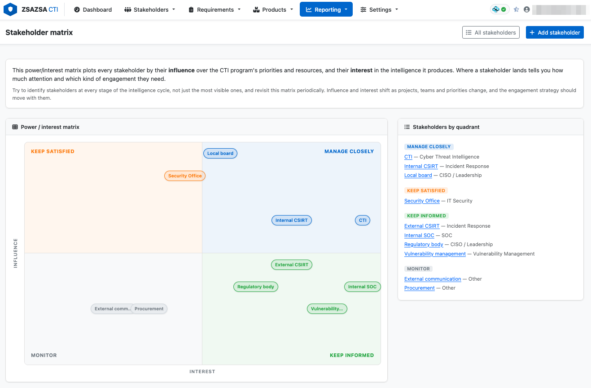
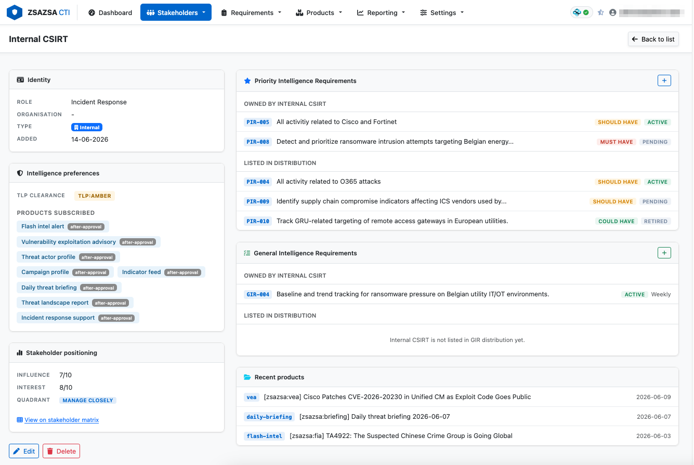
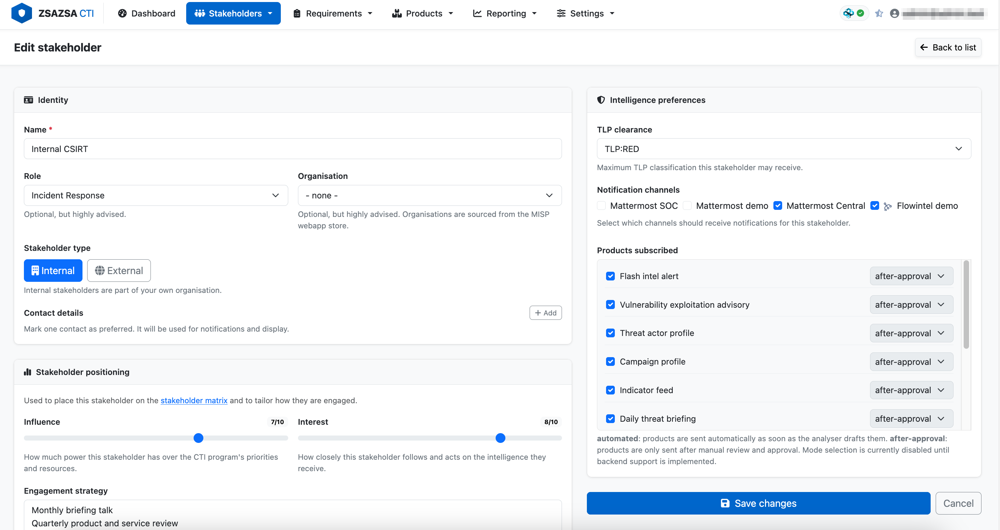

# zsazsa CTI

zsazsa is a **CTI program** management and production platform built around [MISP](https://www.misp-project.org/). It links collection, triage, analyst workflows, requirement management, publishing and stakeholder delivery in one place.

It is designed for teams that want to run threat intelligence as an operational capability, not as loose documents and disconnected scripts. In one workflow, analysts can move from source events to validated intelligence products, align output to PIR and GIR priorities, distribute to stakeholders with channel and TLP controls, and feed stakeholder response back into measurable program maturity signals.

## Platform snapshots

### Overview


### Intelligence Flow


### CTI Program


It is named after one of my cats. The name stayed because it was memorable, and because it sounded like a project that would absolutely chase indicators at 03:00.

## What the application covers

The web app is split into practical operational areas.

The **dashboard** gives a live program snapshot. It shows active PIRs and GIRs, stakeholder counts, analyser pipeline freshness, 24-hour processing outcomes and pending scraper events waiting for analysis.

**Stakeholder management** stores who consumes CTI output, with role, organisation, contact details, TLP clearance, per-product subscription modes, and notification channel preferences. Each stakeholder can be assigned one or more named notification channels (configured under Settings), so products are pushed to the channels that stakeholder is monitored on. The detail view also shows what the stakeholder owns and what products are linked to their requirements.

**Requirement management** supports both PIRs and GIRs with full lifecycle editing. Records include decision context, priority, status, scope, delivery settings and owner fields. Scope fields are synchronised with focus points, and galaxy-backed categories can be synced directly from MISP cluster values.

Focus points are first-class data. They can be added, removed, synchronised and previewed against recent scraper events, while organisation-wide AI focus points are configured centrally in Settings under the Products tab.

**RFI workflow** is implemented end to end, from intake to closure. RFIs include SLA-aware due dates, owner assignment, links to PIR or GIR, response capture and feedback tracking.

**Data collection** pages provide a local cached view of events from the scraper MISP and optional additional MISP servers. Analysts can browse events and reports, view details, trigger cache refresh, and generate an LLM summary report directly back into MISP. Events can be flagged for follow-up. Manual collection entries can be created directly from the UI for intelligence gathered from sources that are not auto-collected (newsletters, partner portals and similar). Each manual entry supports a Markdown description with live preview, scope fields (geography, sectors, threat actors, threat types), external references, file attachments, and direct links to create a Flash Intel Alert or VEA from that entry as a source event.

**Product** pages provide a searchable catalogue of published outputs tagged as CTI products. Analysts can filter by product type and linked PIR, inspect event reports and store feedback as report entries.

**Flash Intel Alert** supports manual drafting, review queue handling, approval and publishing. Drafts can be seeded from one or more source events. Source event accordions in the wizard show reports with rendered Markdown, attributes with one-click append to the observed facts table, and object attributes. Observed facts and exploitation indicators added via the source-event buttons are formatted as Markdown tables. Recommended immediate and near-term actions can be configured as organisation-wide presets and are shown as one-click insert buttons. Context tags from source events can be selected and carried into the product. Publishing can notify Mattermost and email.

**Vulnerability advisory** has an equivalent draft, review and publish flow, including multi-CVE input, CVE-focused fields, PIR linking, source event accordion, indicator table building, and action presets.

**Daily threat briefing** includes a triage queue from scraper events, guided story composition, draft save, edit and publish flow, plus notification on publish.

**Threat landscape report** is a periodic strategic product for leadership audiences. It covers top threats, trending threat actors, key incidents, recommendations and an outlook section. Reports follow the same draft/publish workflow as other products and are stored as MISP objects.

Drafts can be edited and deleted from the product pages, but once a product is published it is locked: it can no longer be edited or deleted in zsazsa. This is deliberate, it guards against accidentally removing something that has already been sent to stakeholders. If a published product genuinely has to be removed, delete its event directly in MISP, which is the system of record. The review and list pages carry a short reminder of this.

**Statistics** pages include pipeline and program views. They aggregate source and outcome trends, RFI and feedback KPIs, product production metrics, PIR coverage checks and MISP source health. There is also a purge action for orphaned analyser log rows. The program statistics page includes a **CTI-CMM maturity signal** panel, which derives observable maturity indicators across five domains (Program, Situation, Analytical production, Operational delivery, and Feedback) from the live program data. These signals map to CTI-CMM levels CTI0 through CTI3 and highlight measurable gaps, giving the team a quick orientation of where the program sits and what to address next.

Community pages provide a local registry of organisations validated against MISP UUIDs and reusable across stakeholder records.

## Notification and distribution flow

Distribution is built around stakeholders, roles, product subscriptions, audiences and notification channels. The intended flow is the following.

A stakeholder is created and takes on exactly one role (SOC, Incident Response, Cyber Threat Intelligence, and so on). Each stakeholder indicates which notification channels they want to receive products on, chosen from the channels configured under Settings (Mattermost webhooks, email recipients and Flowintel instances). A stakeholder also subscribes to one or more product types. The subscription is what the stakeholder wants to receive; the draft or after-approval subscription mode is recorded but currently makes no difference to delivery.

A product is created with one or more audiences. An audience is a stakeholder role, so selecting an audience selects the set of stakeholders holding that role. When a product is published, every selected audience is resolved to its matching stakeholders, and a stakeholder receives the product only if all of the following hold: the stakeholder's role is in the product's audience, the stakeholder is subscribed to that product type, and the stakeholder's TLP clearance is high enough for the product's TLP. Eligible stakeholders then receive the product over the notification channels they configured. A channel can accept every product, or it can be restricted to specific product types. Flowintel is an example of a restricted channel: a case is created only on the Flowintel instances those recipients subscribed to, and only for products that are enabled for that instance in its `case_templates` configuration.

Eligibility is computed centrally by `recipient_preview()` in `webapp/misp_store.py`, which classifies every stakeholder as green (will receive the product), yellow (subscribed but blocked by TLP or audience) or grey (not subscribed). The product detail and review pages show this preview before publishing.

Current per-product coverage:

- **Flash Intel Alert** and **Vulnerability advisory** implement the full flow above, including audience, subscription, TLP gating, and delivery to Mattermost, email and Flowintel.
- **Daily threat briefing** is delivered to all stakeholders subscribed to it, over each recipient's configured notification channels. It has no audience and applies no TLP gating. Mattermost and email are delivered today and plug into the same per-channel-type dispatch.
- **Threat landscape report** records an audience but does not yet push notifications on publish.
- **PIR**, **GIR** and **RFI** are requirements rather than products. They notify an explicitly selected distribution list of stakeholders over Mattermost and email, independent of product subscriptions and audiences.

Email channels deliver the full product as an email (the same Markdown that drives the other channels, rendered to HTML with a plain-text fallback). When a single product reaches several email recipients, their addresses are kept private from one another. Email delivery relies on the shared SMTP server configured on the Notifications tab; the per-channel value is just the recipient address.
- The remaining product types listed under `PRODUCT_TYPES` can be subscribed to but do not yet have a publish-and-notify flow.

## MISP model and tagging approach

The platform stores each business entity as one MISP event, with data held inside a custom MISP object. Custom object templates live in `webapp/misp_objects/`.

Entity type to MISP object mapping:

| Entity | MISP object |
|---|---|
| Stakeholder | zsazsa-stakeholder |
| PIR | zsazsa-pir |
| GIR | zsazsa-gir |
| RFI | zsazsa-rfi |
| Flash Intel Alert | zsazsa-flash-intel |
| VEA | zsazsa-vea |
| Daily briefing | zsazsa-daily-briefing |
| Threat landscape report | zsazsa-threat-landscape-report |
| Collection source | zsazsa-collection-source |

Every entity event carries a type tag so it can be searched and filtered independently of the object. All tags in the `zsazsa:` namespace are applied as local tags, so they never sync to connected MISP instances. Because MISP attaches tags embedded at event creation globally even when the local flag is set, the application applies these tags through the tag endpoint right after the event is created. The default tag values in use are:

```
TAG_STAKEHOLDER  = zsazsa:type="stakeholder"
TAG_PIR          = zsazsa:type="pir"
TAG_GIR          = zsazsa:type="gir"
TAG_RFI          = zsazsa:type="rfi"
TAG_FLASH_INTEL  = zsazsa:ctiproduct="flash-intel"
TAG_VEA          = zsazsa:ctiproduct="vea"
TAG_BRIEFING     = zsazsa:ctiproduct="daily-briefing"
```

Product events additionally carry `curation:ctiproduct` tags so they can be searched and grouped consistently across the product catalogue.

Manual collection entries are stored on the webapp MISP server. They carry the scraper marker tag (`zsazsa:source="misp-scraper"` by default), a TLP tag, `zsazsa:source-type="manual"`, and a local `zsazsa:source="<source-name>"` tag linking the entry to the configured manual source. Galaxy-backed scope tags (geography, sector, threat actor, MITRE ATT&CK) are applied as regular MISP tags. The entry description is stored as a MISP event report in Markdown. File attachments are added as attachment attributes in the External analysis category.

Events that need analyst follow-up are flagged with `zsazsa:collection="follow-up"` as a local tag.

Focus points are stored as event-level text attributes with the comment `zsazsa:fp` and value format `category|value|notes`. This keeps add and delete operations simple and lets scope values be regenerated safely without losing other attribute data.

## Configuration

Main runtime settings are in `config/__init__.py`.

You can configure:

- scraper and webapp MISP connections
- optional extra MISP sources for the collection browser
- manual collection sources (structured registry with name, owner, location, description, enable/disable, and Admiralty scale reliability rating - each backed by a MISP event)
- product type catalogue
- recommended immediate and near-term actions shown as presets in Flash Intel and VEA wizards
- notification channels (named Mattermost webhooks and email recipients, each with a name and enable/disable toggle, plus the shared SMTP server used for email)
- analyser polling window and marker tag
- log settings and file paths

The configuration page organises settings across tabs (Connections, Products, System, Prompts, Context elements, Notifications). Collection sources - the MISP scraper connection, additional MISP servers, and manual sources - are managed at `/config/sources/`. MISP connections can be tested live. Each server entry can be saved individually. Manual sources have per-source enable/disable with an in-use guard against PIR/GIR references. The config file is backed up automatically before each save.

## What you need before installing

zsazsa sits on top of MISP and requires the following infrastructure to be in place first:

- **A MISP server to store CTI program data.** This is where zsazsa saves its objects: stakeholders, PIRs, GIRs, flash intel alerts, advisories, briefings, and so on. This is the server you point `MISP_WEBAPP_URL` at.

- **A MISP server running misp-scraper.** The scraper feeds threat events into a MISP instance that zsazsa polls for the data collection view and the analyser pipeline. This is the server you point `MISP_URL` at. It can be the same server as above.

- **One or more additional MISP servers (optional but recommended).** zsazsa can pull threat events from other MISP instances configured under Collection sources. These act as supplementary intelligence feeds. Ideally these are separate servers from your own MISP, such as partner-operated or community instances.

zsazsa does not install MISP or misp-scraper. Follow the official installation guides for those projects first.

## Installation

Installation is recommended inside the MISP custom application directory (create it if it doesn't already exist `mkdir /var/www/MISP/misp-custom ; chown www-data:www-data /var/www/MISP/misp-custom`) so that it runs under the same web user as MISP. On Ubuntu this means installing as `www-data`:

```bash
cd /var/www/MISP/misp-custom
sudo -u www-data git clone <this-repo> zsazsa
cd zsazsa
sudo -u www-data bash docs/install.sh
```

The installer creates a `venv` in the project root, installs Python dependencies, prepares the data directory, and creates `config/__init__.py` if needed.

After installation, edit `config/__init__.py` and set your MISP URL and API key settings. If you want to run zsazsa as a systemd service, use `docs/zsazsa.service.template` as your starting point.

## Upgrading

Go to the installation directory and pull as the web user:

```bash
cd /var/www/MISP/misp-custom/zsazsa
sudo -u www-data git pull
```

Then restart the service to pick up the changes:

```bash
sudo systemctl restart zsazsa.service
```

## Running the application

```bash
source venv/bin/activate
python run_webapp.py
```

The application listens on `http://0.0.0.0:5000` by default. Open it in a browser at the IP address or hostname of your server.

Run the analyser pipeline (typically via cron):

```bash
source venv/bin/activate
python run_analyser.py
```

The hostname zsazsa listens on, as well as the port, are configurable in `config.py`:

```python
HOSTNAME = 'zsazsa.example.com'   # or an IP address
PORT = 5000
```

These values can also be changed from the Settings page in the web app (System tab). After saving, restart the application for the port change to take effect (the HOSTNAME value is stored for reference; the listener address is always `0.0.0.0`).

## Production deployment behind Apache

zsazsa is designed to run alongside MISP and can be served under a subpath of the MISP Apache virtual host, for example `https://misp.example.com/zsazsa`. The application adapts to any subpath automatically, so `/cti`, `/cti-program`, or any other value works without changing the application.

### 1. Keep the app running with systemd

Copy the service template and adjust paths and user:

```bash
sudo cp docs/zsazsa.service.template /etc/systemd/system/zsazsa.service
# edit the file, then:
sudo systemctl daemon-reload
sudo systemctl enable --now zsazsa.service
```

For production, bind the listener to localhost so it is only reachable through Apache. In `run_webapp.py`, change:

```python
app.run(host="0.0.0.0", ...)
```

to:

```python
app.run(host="127.0.0.1", ...)
```

Leave it as `0.0.0.0` for development if you need direct access from other machines on the network.

### 2. Enable required Apache modules

```bash
sudo a2enmod proxy proxy_http headers
sudo systemctl reload apache2
```

### 3. Add the proxy to the MISP virtual host

Inside the existing `<VirtualHost *:443>` block in your MISP Apache configuration, add:

```apache
# zsazsa CTI application
ProxyPreserveHost On
RequestHeader set X-Forwarded-Prefix "/zsazsa"
RequestHeader set X-Forwarded-Proto "https"

ProxyPass        /zsazsa  http://127.0.0.1:5000/
ProxyPassReverse /zsazsa  http://127.0.0.1:5000/
```

The value in `RequestHeader set X-Forwarded-Prefix` must match the path used in `ProxyPass` and `ProxyPassReverse`. To use a different subpath, change all three occurrences. No application restart is needed for subpath changes, only an Apache reload (`systemctl reload apache2`).

The application reads `X-Forwarded-Prefix` at runtime to construct links and AJAX call paths, and reads `X-Forwarded-Proto` to build correct `https://` URLs in Mattermost notifications and product preview links. When run directly without a proxy, both headers are absent and the application behaves exactly as before.


# Blog posts and further reading

[Create a daily threat briefing with zsazsa and MISP](https://www.misp-project.org/2026/06/08/zsazsa-create-a-daily-threat-briefing.html/) on the MISP project website walks through the full workflow for producing a daily threat briefing, from source event triage to publishing.

# Screenshots and features

## MISP

zsazsa keeps its operational data in MISP, using events, object templates, attributes and event reports. This keeps auditability clear and allows teams to inspect raw records directly in MISP when needed.


The second view shows how product content and supporting context sit together in one place, so analysts can move from collection evidence to published output without losing traceability.


## Dashboard

The dashboard gives a quick operational picture, including pipeline state, active requirements, stakeholder footprint and recent processing results.


The built-in reference panel helps teams apply common intelligence concepts consistently, including Admiralty Scale, TLP and CTI evaluation criteria.


## Stakeholders

Stakeholders are managed locally and linked to MISP organisations. Each record supports internal or external roles, multiple contact fields, TLP clearance, product subscriptions and delivery preferences, so distribution can match real organisational needs.


Stakeholders can be linked to PIRs and GIRs for ownership and distribution, which makes accountability and downstream delivery easier to track.

**Stakeholder matrix**








## PIR

PIR pages capture the core intelligence questions that drive collection and analysis priorities.


Triage allows submitted PIRs to be acknowledged, approved, deferred, rejected or merged with clear decision context.


The PIR detail view combines scope, sub-questions, ownership, distribution and collection mapping so analysts can maintain one coherent requirement record.


## GIR

GIR records intelligence needs over longer cycles, including review cadence, scope and expected outputs for recurring reporting.


## RFI

The RFI workflow covers intake through closure, with priority, SLA, owner assignment, requirement linkage and response tracking.


## Data collection

The data collection view provides a cached feed with filters for source, tags and context, helping analysts sift large event volumes quickly.


CTI evaluation can be applied during collection triage to score relevance and confidence before product drafting.


From the same view, analysts can launch product creation directly from selected source events.


Daily threat briefing drafting is integrated into the collection workflow, so triaged items can be turned into a briefing without context switching.


Vulnerability advisory creation follows the same pattern, with evidence and indicators carried forward from source events.


## Importing newsletters

Many teams receive curated security newsletters by e-mail, for example the ETDA Cyber Threat Intelligence (CTI Robot) digest, where each edition lists dozens of articles, each with a short title, an intro, a section and a criticality. Rather than copy these in one by one, the newsletter importer turns a pasted e-mail into a reviewable list of articles.

Open the importer from the Data collection page with "Import from newsletter". Choose the newsletter format, paste the full e-mail, and select "Parse and review". The importer extracts every article with its section (Financial Sector, Vulnerabilities, Malware, and so on), its criticality (Critical, Urgent, Important) and its links, grouped by section.

On the review screen you decide what is worth collecting. Critical and urgent items are pre-selected.

Sending does two things. Each selected article link is handed to the misp-scraper, which fetches the article and creates a MISP event for it, so it flows through the normal collection pipeline. The newsletter e-mail is also archived as its own MISP event, with the raw e-mail kept as a report and the selected links attached.

Before sending, make sure the misp-scraper subscriber is running and its Redis connection is configured (see "Manual sources pushing to scraper" further down). If no subscriber is listening when you send, the importer tells you so nothing is silently lost.

### Technical notes

Each newsletter format has its own parser registered in `webapp/newsletter_parsers.py` (the `PARSERS` map), so supporting a new format means writing one parser and registering it; the import screens themselves are format-agnostic. Parsing is pure text processing and never touches MISP.

The hand-off to the scraper uses Redis publish/subscribe: zsazsa publishes one JSON message per selected article on the configured channel, and the scraper's `subscribe` service consumes it. The connection (`SCRAPER_REDIS_HOST`, `SCRAPER_REDIS_PORT`, `SCRAPER_REDIS_PASSWORD`, `SCRAPER_REDIS_CHANNEL`) is set on the "Manual sources pushing to scraper" card, and is separate from the Redis that zsazsa reads MISP login sessions from.

Each message carries the article link, the title, the newsletter name as the feed title, and `feed_tags` that the scraper applies as local tags on the created event.

### Collecting newsletters from a mailbox (IMAP)

Instead of pasting each edition by hand, zsazsa can read newsletters straight from a mailbox. Forward the newsletter (for example the ETDA digest) to a mailbox, and zsazsa polls that mailbox, processes new editions the same way the manual importer does, and marks the e-mail as handled so it is never processed twice.

Mailboxes are configured on the Collection sources page (`/config/sources/`) under "IMAP mailboxes". A mailbox holds only the connection: IMAP host, port, SSL, username and password, and the folder to read (default `INBOX`). Under it you add one or more **data collection sources**, one per newsletter that arrives in the mailbox. Each source has a name, the parser to apply, its own match criteria (a list of subjects and a list of senders, one per line), an Admiralty reliability rating, and a mode. A message is handed to the first source whose subject contains any of its subject terms or whose sender contains any of its sender terms (case-insensitive); leaving both lists empty makes a source take every message, which suits a mailbox dedicated to one newsletter. Because forwarding rewrites the envelope sender, the sender match also looks at the original `From:` line inside a forwarded message, so you can match on the newsletter's real sender. The connection can be checked with "Test connection" before saving. The password is stored like the other secrets, in `config.py` under `IMAP_SOURCES` (a mailbox password must not live in a MISP event, which is why the mailbox configuration is kept in `config.py` rather than the MISP-backed source registry).

The source's name is what events are attributed to: it becomes the feed handed to the scraper, so the events created from its articles carry `scraper:data-collection-source:<name>`. The pipeline page counts these per source in its "By collection source" and "Email sources" panels, showing a live count of the events currently carrying each source's tag (read from MISP's tag statistics, so it matches what you see when filtering the data collection on that tag). Splitting a mailbox into several named sources is therefore also how you track, separately, how much each newsletter contributes.

Each source runs in one of two modes. In **automatic** mode a matched newsletter is archived in MISP and its article links are pushed to the scraper immediately. In **manual review** mode the newsletter is archived and parked in the pending queue so a human chooses the articles before anything is pushed. Open the queue from the Data collection page with "Email sources"; reviewing one shows the same article selection screen as the manual importer. Because the scraper hand-off is fire-and-forget, an automatic push that finds no scraper listening is moved to the pending queue rather than lost, so it can be retried from there.

Polling is done by `run_imap_collector.py`, intended to run from cron, for example every fifteen minutes:

```
*/15 * * * * cd /path/to/zsazsa && venv/bin/python run_imap_collector.py
```

The Pipeline page (`/pipeline`) shows mailbox status in two places: an "IMAP mailboxes" panel lists each configured mailbox with when it was last polled and the result, and each poll also appears in the run history as "Mailbox poll". A processed message is flagged in the mailbox with a dedicated IMAP keyword (`zsazsaProcessed`) and also marked Seen and Flagged as a visible cue. The keyword, not the read state, is what prevents reprocessing, so opening the mailbox by hand does not interfere. Nothing is ever deleted from the mailbox. Mailbox body handling prefers the plain-text part, falls back to converting the HTML part, and strips the forwarded-message header block before parsing.

## Statistics

The statistics pages combine operational metrics with CTI maturity signals.


## AI Support

AI-assisted features support analyst efficiency in triage, relevance checking and drafting.


## Data collection source management

Source management allows teams to manage collection sources centrally, including manual sources and additional MISP instances.


# Why the name zsazsa

Officially, it is the cat.


Unofficially, if anyone asks in a meeting, you can pick one of these:

- Zonal Security Analysis for Zero-day Situation Awareness
- Zero-day Signal Analysis and Strategic Assessment
- Zenith Sentinel for Adversary Surveillance and Alerting
- Zettabyte Source Aggregation for Security Analytics
- Zero-latency Surveillance and Alerting for Security Analysts
- Zealous Search and Attribution for Strategic Analysis
- Zone-focused Scouting and Assessment for Security Assurance
- Zero-trust Scoring and Adversary Signal Assessment

# Configuration settings

Almost all runtime settings are in `config/__init__.py`, and most of them can be changed from the web interface without editing the file directly. The main settings page is at `/config` and groups settings across eight tabs: **Connections**, **Products**, **System**, **Prompts**, **AI**, **Context elements**, **Notifications** and **Styling**. A few settings, namely the MISP scraper connection, the list of additional **MISP servers**, and the manual **collection sources**, are managed on a separate page at `/config/sources/`, covered in its own section below. Whichever page you save from, the previous version of `config/__init__.py` is copied to `config/__init__.py.backup` first.

## Connections

This tab covers the MISP server zsazsa uses as its own **data store**, configured through `MISP_WEBAPP_URL`, `MISP_WEBAPP_KEY` and `MISP_WEBAPP_VERIFYCERT`. This is the MISP instance holding the stakeholder, PIR, GIR, RFI and product events created by zsazsa itself, and is separate from the scraper MISP described under data collection sources. The tab also holds `OPENAI_API_KEY`, alongside a display of recent OpenAI token usage.

| Setting | Description |
|---|---|
| `MISP_WEBAPP_URL` | URL of the MISP server zsazsa uses to store its own program data |
| `MISP_WEBAPP_KEY` | API key for the webapp MISP server |
| `MISP_WEBAPP_VERIFYCERT` | Whether to verify the webapp MISP server's TLS certificate |
| `OPENAI_API_KEY` | API key used for all OpenAI-based AI features |

## Products

The Products tab covers settings how products and requirements are categorised and summarised. `PRODUCT_TYPES` defines the catalogue of CTI product types offered when creating a product. `DAILY_BRIEFING_TITLE_EXCLUSIONS` lists story titles or phrases that the daily briefing analyser should ignore when proposing stories. The five `FOCUS_POINTS_*` lists (geographies, sectors, technologies, threat types and threat actors) define the organisation-wide focus points used when previewing relevance against scraper events and when generating AI summaries. `THREAT_ACTOR_TYPES` is a small table of threat actor type names and descriptions, based on the ENISA taxonomy, used when classifying threat actors in products and requirements.

| Setting | Description |
|---|---|
| `PRODUCT_TYPES` | Catalogue of CTI product types offered when creating a product |
| `DAILY_BRIEFING_TITLE_EXCLUSIONS` | Story titles or phrases the daily briefing analyser should ignore |
| `FOCUS_POINTS_GEOGRAPHIES` | Organisation-wide geography focus points |
| `FOCUS_POINTS_SECTORS` | Organisation-wide sector focus points |
| `FOCUS_POINTS_TECHNOLOGIES` | Organisation-wide technology focus points |
| `FOCUS_POINTS_THREAT_TYPES` | Organisation-wide threat type focus points |
| `FOCUS_POINTS_THREAT_ACTORS` | Organisation-wide threat actor focus points |
| `THREAT_ACTOR_TYPES` | Threat actor type names and descriptions (ENISA taxonomy) |

## System

The System tab is split into three cards. The Analyser card contains `POLL_WINDOW_HOURS` (how far back the analyser looks for new events on each run), `EVENT_LOG_RETENTION_DAYS` (how long rows in the `event_log` table are kept) and `PIPELINE_RUN_LOG_RETENTION_DAYS` (how long pipeline run history is kept). The Logging card sets `LOG_LEVEL`. The Web server card covers `HOSTNAME` and `PORT`, plus `SSL_ENABLED`, `SSL_CERT` and `SSL_KEY` for running the built-in server with TLS. After changing the port or SSL settings, restart the application for the change to take effect; the listener address itself is always `0.0.0.0` regardless of the `HOSTNAME` value, which is kept mainly for reference and for building links.

| Setting | Description |
|---|---|
| `POLL_WINDOW_HOURS` | How far back the analyser looks for new events on each run |
| `EVENT_LOG_RETENTION_DAYS` | How long rows in the `event_log` table are kept |
| `PIPELINE_RUN_LOG_RETENTION_DAYS` | How long pipeline run history is kept |
| `LOG_LEVEL` | Logging verbosity |
| `HOSTNAME` | Hostname or IP shown for reference and used to build links |
| `PORT` | Port the application listens on |
| `SSL_ENABLED` | Whether the built-in server uses TLS |
| `SSL_CERT` | Path to the TLS certificate file |
| `SSL_KEY` | Path to the TLS private key file |

## Prompts

This tab lists every prompt template file found in `zsazsaprompts/`. New prompt files can also be created from here. Two prompts have a strict output format that the application parses back into structured data:

| Prompt file | Constraint |
|---|---|
| `summarise_misp_report` | Must keep its `**Targeted sector:**`, `**Geographic scope:**`, `**MITRE ATT&CK techniques:**`, `**Threat actor:**` and `**Vendor/Technology:**` headings |
| `flash_intel_generate` | Must keep its overall section and field structure, since the "Generate AI draft" feature reads it line by line |

Changing these headings or structure will cause the corresponding feature to fail silently.

## AI

The AI tab sets `OPENAI_MODEL`, the default model used by any AI-assisted feature that does not specify its own. Below that, a table lists each AI-assisted feature (for example summarising a report or generating a Flash Intel Alert draft) with its provider, an optional per-feature model override, and the prompt file it uses. This feature-level configuration is stored separately, in `core/ai_config.py`, rather than in `config/__init__.py`. Because these features send raw MISP event content to the configured LLM, only connect AI features to MISP servers you trust, and review AI-generated output before publishing it.

| Setting | Description |
|---|---|
| `OPENAI_MODEL` | Default OpenAI model used by AI features that don't specify their own |
| Per-feature model and prompt (`core/ai_config.py`) | Optional model override and prompt file for each AI-assisted feature |

## Context elements

This tab covers the MISP tags and presets for the zsazsa's tags. The entity type markers `TAG_STAKEHOLDER`, `TAG_PIR`, `TAG_GIR` and `TAG_RFI` identify the corresponding zsazsa entities in MISP. The product classification tags `TAG_FLASH_INTEL`, `TAG_VEA`, `TAG_BRIEFING` and `TAG_TLR` mark published products by type. `SCRAPER_MARKER_TAG` is the tag the analyser and the data collection page use to recognise events coming from the misp-scraper instance, and `TAG_COLLECTION_FOLLOWUP` is the tag used to flag collection items for analyst follow-up. `RECOMMENDED_ACTIONS_IMMEDIATE` and `RECOMMENDED_ACTIONS_NEAR_TERM` are organisation-wide presets offered as one-click insert buttons in the Flash Intel and VEA wizards. Finally, `COLLECTION_TAG_STRIP_PREFIXES` and `COLLECTION_TAG_HIDE_PREFIXES` control how tags are shortened or hidden when displaying events on the data collection page.

| Setting | Description |
|---|---|
| `TAG_STAKEHOLDER` | Marks stakeholder events |
| `TAG_PIR` | Marks PIR events |
| `TAG_GIR` | Marks GIR events |
| `TAG_RFI` | Marks RFI events |
| `TAG_FLASH_INTEL` | Marks published Flash Intel Alert products |
| `TAG_VEA` | Marks published VEA products |
| `TAG_BRIEFING` | Marks published daily briefing products |
| `TAG_TLR` | Marks published threat landscape report products |
| `SCRAPER_MARKER_TAG` | Identifies events coming from the misp-scraper instance |
| `TAG_COLLECTION_FOLLOWUP` | Flags collection items for analyst follow-up |
| `RECOMMENDED_ACTIONS_IMMEDIATE` | Preset immediate actions offered as one-click inserts |
| `RECOMMENDED_ACTIONS_NEAR_TERM` | Preset near-term actions offered as one-click inserts |
| `COLLECTION_TAG_STRIP_PREFIXES` | Tag prefixes shortened on the data collection page |
| `COLLECTION_TAG_HIDE_PREFIXES` | Tag prefixes hidden on the data collection page |

## Notifications

The Notifications tab manages `NOTIFICATION_CHANNELS`, a list of named channels. Each channel has a type: a **Mattermost** channel carries a webhook URL, an **email** channel carries a recipient address. Stakeholders are subscribed to one or more of these channels under Stakeholder management, so published products and requirement updates reach the right destinations. For backwards compatibility, the legacy `MATTERMOST_ENABLED` and `MATTERMOST_WEBHOOK_URL` settings are derived automatically from the first enabled Mattermost channel and do not need to be set by hand.

Email channels share one SMTP server, configured in the same tab and stored in the `SMTP_*` settings. The "Test connection" button checks the SMTP host and credentials without sending anything; each email channel also has a button to send a test message to its recipient. For Gmail and similar providers, use an account-specific app password rather than the normal account password.

| Setting | Description |
|---|---|
| `NOTIFICATION_CHANNELS` | Named channels. Mattermost: name, URL, TLS verification, enabled flag. Email: name, recipient address, enabled flag |
| `MATTERMOST_ENABLED` (legacy) | Derived automatically from the first enabled Mattermost channel |
| `MATTERMOST_WEBHOOK_URL` (legacy) | Derived automatically from the first enabled Mattermost channel |
| `SMTP_HOST`, `SMTP_PORT` | SMTP server address and port (for example `smtp.gmail.com` and `587`) |
| `SMTP_USE_TLS` | Use STARTTLS on the connection |
| `SMTP_USERNAME`, `SMTP_PASSWORD` | SMTP credentials (use an app password where the provider requires one) |
| `SMTP_FROM` | From address shown on outgoing mail |

## Styling

The Styling tab covers branding used in PDF exports and notifications: `BRAND_COMPANY` and `BRAND_DEPARTMENT` (shown in PDF headers and footers), `BRAND_LOGO` (uploaded here and stored under the application's static files), and the three brand colours `BRAND_COLOR_1`, `BRAND_COLOR_2` and `BRAND_COLOR_3`, used throughout generated PDFs and Mattermost message styling.

| Setting | Description |
|---|---|
| `BRAND_COMPANY` | Company name shown in PDF headers and footers |
| `BRAND_DEPARTMENT` | Department name shown in PDF headers and footers |
| `BRAND_LOGO` | Logo image used in generated PDFs and notifications |
| `BRAND_COLOR_1` | Primary brand colour |
| `BRAND_COLOR_2` | Secondary brand colour |
| `BRAND_COLOR_3` | Tertiary brand colour |

## Settings not exposed in the interface

A small number of settings are only ever set by editing `config/__init__.py` directly. `SECRET_KEY` is the Flask session secret and should be unique per installation. `STATE_FILE`, `DB_FILE` and `LOG_FILE` are filesystem paths for the analyser state, the SQLite database and the log file respectively. `COLLECTION_SOURCES` is rebuilt automatically from the scraper, the additional MISP servers and the manual collection sources every time the configuration is loaded, so it should not be edited by hand.

| Setting | Description |
|---|---|
| `SECRET_KEY` | Flask session secret, should be unique per installation |
| `STATE_FILE` | Path to the analyser state file |
| `DB_FILE` | Path to the SQLite database |
| `LOG_FILE` | Path to the log file |
| `COLLECTION_SOURCES` | Auto-derived list of collection sources, do not edit by hand |

# Creating data collection sources

The `/config/sources/` page is where every source the analyser and the data collection view can pull from is configured: the misp-scraper connection, any additional MISP servers, and manual collection sources for material that is not collected automatically.

## MISP scraper connection

The "MISP scraper (collection pipeline)" card holds the connection to the misp-scraper instance: its URL, API key, whether to verify TLS, and the maximum number of events to pull per run (`MISP_SCRAPER_LIMIT`). This source is always active and always appears on the Data collection page. The "Test connection" button checks the URL and API key against the MISP server, and "Pull estimate" reports how many events currently match the scraper marker tag, which is itself configured on the Context elements tab of `/config`. The "Show query" link displays the underlying `misp.search()` call for reference.

| Field | Description |
|---|---|
| URL | Address of the misp-scraper MISP instance (`MISP_URL`) |
| API key | API key for the scraper MISP instance (`MISP_KEY`) |
| Verify TLS | Whether to verify the scraper MISP server's TLS certificate (`MISP_VERIFYCERT`) |
| Max events | Maximum number of events pulled per run (`MISP_SCRAPER_LIMIT`) |

## Additional MISP servers

The "Other MISP servers" card lists any extra MISP instances configured in `MISP_SERVERS`, such as community MISP servers. Use "Add MISP server" to create a new entry, then fill in a label, an optional ID (used as a URL slug, generated from the label if left blank), the server URL, API key and TLS verification setting. Only published events are fetched from these servers. Filtering is controlled with three tag fields, tags that an event must have any of, tags it must have all of, and tags that exclude it, plus an optional organisation filter that can either restrict results to a set of organisation UUIDs or exclude them. "Events from last (days)" sets how far back to look based on the event date, and "Max events" caps how many events are pulled. As with the scraper, each server can be tested, given a pull estimate, and have its query previewed before saving. Each server is saved individually with its own "Save server" button, can be enabled or disabled with the power icon, and can be deleted. Disabling or deleting a server that is referenced by a PIR or GIR as a collection source will warn you first, since the reference itself is not removed.

| Field | Description |
|---|---|
| Label | Display name for the server |
| ID | URL slug, generated from the label if left blank |
| URL | Address of the MISP server |
| API key | API key for the MISP server |
| Verify TLS | Whether to verify the server's TLS certificate |
| Tags OR | Fetch events with any of these tags |
| Tags AND | Fetch events with all of these tags |
| Tags NOT | Exclude events with any of these tags |
| Organisation filter | Include only, or exclude, events from the given organisation UUIDs |
| Events from last (days) | How far back to look, based on the event date |
| Max events | Maximum number of events pulled per query |
| Enabled | Whether the server is active and offered as a filter option |

## Manual collection sources

The "Manual sources" card lists collection sources that are not MISP servers, for example a newsletter, a partner portal, or any other feed an analyst monitors by hand. Selecting "Add manual source" opens a form with a name (shown in PIR and GIR collection source dropdowns), an owner (the person or team responsible for monitoring it), a location (a URL, file path or physical location), a description of what the source covers and why it matters, and a source reliability rating on the Admiralty scale.

| Field | Description |
|---|---|
| Name | Name shown in PIR and GIR collection source dropdowns |
| Owner | Person or team responsible for monitoring the source |
| Location | URL, file path or physical location of the source |
| Description | What the source covers and why it matters |
| Source reliability | Admiralty scale rating, applied as an `admiralty-scale:source-reliability` tag |

Each manual source is itself stored as a `zsazsa-collection-source` event in the webapp MISP, and can be edited, enabled or disabled, or deleted from the list. As with additional MISP servers, disabling or deleting a manual source that is referenced by a PIR or GIR will prompt for confirmation first, since the reference itself is not removed.

## IMAP mailboxes

The "IMAP mailboxes" card configures mailboxes that `run_imap_collector.py` polls for forwarded newsletters (covered in "Collecting newsletters from a mailbox" above). Each entry is stored in `config.IMAP_SOURCES`.

| Field | Description |
|---|---|
| Name | Display name for the mailbox |
| Newsletter parser | Which newsletter parser to apply to matched mail |
| Mode | `Automatic` (push articles immediately) or `Manual review` (park for human approval) |
| IMAP host / Port / SSL | Connection to the mail server (default port 993 with SSL) |
| Folder | Mailbox folder to read (default `INBOX`) |
| Username / Password | Mailbox credentials (use an app password where the provider requires one) |
| Match subjects | Subject substrings, one per line; a match on any one selects the mail |
| Match senders | Sender substrings, one per line; matched against the From header and a forwarded message's original sender |
| Source reliability | Admiralty scale rating recorded for the source |

"Test connection" opens the mailbox with the entered settings without reading or changing any mail. Polling never deletes mail; processed messages are flagged with the `zsazsaProcessed` IMAP keyword so they are not handled twice.

## Manual sources pushing to scraper

Some manual sources do not store events directly but hand article links to the misp-scraper, which fetches and creates them.

| Field | Description |
|---|---|
| Redis host | Host of the misp-scraper Redis (`SCRAPER_REDIS_HOST`) |
| Port | Redis port (`SCRAPER_REDIS_PORT`) |
| Password | Redis password, if the instance requires one (`SCRAPER_REDIS_PASSWORD`) |
| Channel | Publish/subscribe channel the scraper subscribes to (`SCRAPER_REDIS_CHANNEL`, default `urls`) |

The scraper's own `subscribe` service must be running.
