# zsazsa CTI

zsazsa is a **CTI program** management and production platform built around [MISP](https://www.misp-project.org/). It links collection, triage, analyst workflows, requirement management, publishing and stakeholder delivery in one place.

It is designed for teams that want to run threat intelligence as an operational capability, not as loose documents and disconnected scripts. In one workflow, analysts can move from source events to validated intelligence products, align output to PIR and GIR priorities, distribute to stakeholders with channel and TLP controls, and feed stakeholder response back into measurable program maturity signals.

## Platform snapshots

### Overview

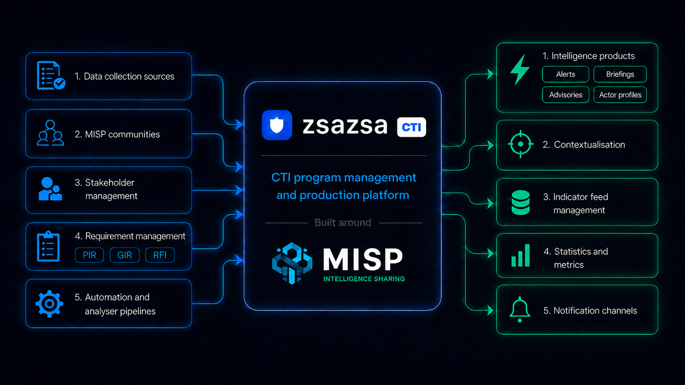

### Intelligence Flow

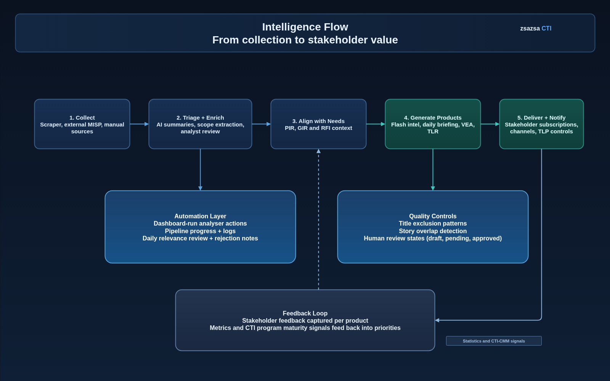

### CTI Program

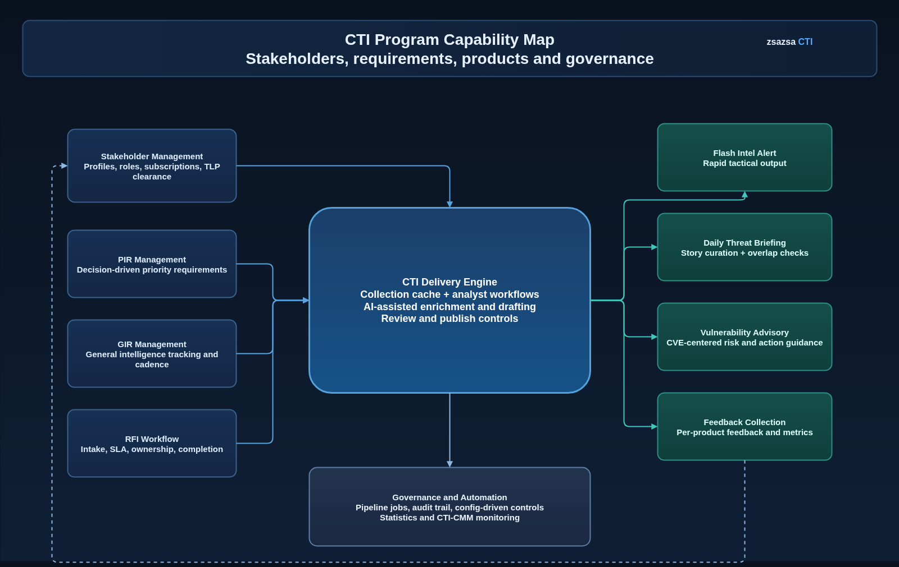

It is named after one of my cats. The name stayed because it was memorable, and because it sounded like a project that would absolutely chase indicators at 03:00.

## What the application covers

The web app is split into practical operational areas.

The **dashboard** gives a live program snapshot. It shows active PIRs and GIRs, stakeholder counts, analyser pipeline freshness, 24-hour processing outcomes and pending scraper events waiting for analysis.

**Stakeholder management** stores who consumes CTI output, with role, organisation, contact details, TLP clearance, per-product subscription modes, and notification channel preferences. Each stakeholder can be assigned one or more named notification channels (configured under Settings), so products are pushed to the channels that stakeholder is monitored on. The detail view also shows what the stakeholder owns and what products are linked to their requirements.

**Requirement management** supports both PIRs and GIRs with full lifecycle editing. Records include decision context, priority, status, scope, delivery settings and owner fields. Scope fields are synchronised with focus points, and galaxy-backed categories can be synced directly from MISP cluster values.

Focus points are first-class data. They can be added, removed, synchronised and previewed against recent scraper events, while organisation-wide AI focus points are configured centrally in Settings under the Products tab.

**RFI workflow** is implemented end to end, from intake to closure. RFIs include SLA-aware due dates, owner assignment, links to PIR or GIR, response capture and feedback tracking.

**Data collection** pages provide a local cached view of events from the scraper MISP and optional additional MISP servers. Analysts can browse events and reports, view details, trigger cache refresh, and generate an LLM summary report directly back into MISP. Events can be flagged for follow-up. Manual collection entries can be created directly from the UI for intelligence gathered from sources that are not auto-collected (newsletters, partner portals and similar). Each manual entry supports a Markdown description with live preview, scope fields (geography, sectors, threat actors, threat types), external references, file attachments, and direct links to create a Flash Intel Alert or VEA from that entry as a source event.

**Product** pages provide a searchable catalogue of published outputs tagged as CTI products. Analysts can filter by product type and linked PIR, inspect event reports and store feedback as report entries.

**Flash Intel Alert** supports manual drafting, review queue handling, approval and publishing. Drafts can be seeded from one or more source events. Source event accordions in the wizard show reports with rendered Markdown, attributes with one-click append to the observed facts table, and object attributes. Observed facts and exploitation indicators added via the source-event buttons are formatted as Markdown tables. Recommended immediate and near-term actions can be configured as organisation-wide presets and are shown as one-click insert buttons. Context tags from source events can be selected and carried into the product. Publishing can notify Mattermost.

**Vulnerability Exploitation Advisory** has an equivalent draft, review and publish flow, including multi-CVE input, CVE-focused fields, PIR linking, source event accordion, indicator table building, and action presets.

**Daily threat briefing** includes a triage queue from scraper events, guided story composition, draft save, edit and publish flow, plus notification on publish.

**Threat landscape report** is a periodic strategic product for leadership audiences. It covers top threats, trending threat actors, key incidents, recommendations and an outlook section. Reports follow the same draft/publish workflow as other products and are stored as MISP objects.

**Statistics** pages include pipeline and program views. They aggregate source and outcome trends, RFI and feedback KPIs, product production metrics, PIR coverage checks and MISP source health. There is also a purge action for orphaned analyser log rows. The program statistics page includes a **CTI-CMM maturity signal** panel, which derives observable maturity indicators across five domains (Program, Situation, Analytical production, Operational delivery, and Feedback) from the live program data. These signals map to CTI-CMM levels CTI0 through CTI3 and highlight measurable gaps, giving the team a quick orientation of where the program sits and what to address next.

Community pages provide a local registry of organisations validated against MISP UUIDs and reusable across stakeholder records.

## MISP model and tagging approach

The platform stores each business entity as one MISP event, with data held inside a custom MISP object. Custom object templates live in `webapp/misp_objects/`.

Entity type to MISP object mapping:

| Entity | MISP object |
|---|---|
| Stakeholder | zsazsa-stakeholder |
| PIR | zsazsa-pir |
| GIR | zsazsa-gir |
| RFI | zsazsa-rfi |
| Flash Intel Alert | zsazsa-flash-intel |
| VEA | zsazsa-vea |
| Daily briefing | zsazsa-daily-briefing |
| Threat landscape report | zsazsa-threat-landscape-report |
| Collection source | zsazsa-collection-source |

Every entity event carries a type tag so it can be searched and filtered independently of the object. The default tag values in use are:

```
TAG_STAKEHOLDER  = zsazsa:type="stakeholder"
TAG_PIR          = zsazsa:type="pir"
TAG_GIR          = zsazsa:type="gir"
TAG_RFI          = zsazsa:type="rfi"
TAG_FLASH_INTEL  = zsazsa:ctiproduct="flash-intel"
TAG_VEA          = zsazsa:ctiproduct="vea"
TAG_BRIEFING     = zsazsa:ctiproduct="daily-briefing"
```

Product events additionally carry `curation:ctiproduct` tags so they can be searched and grouped consistently across the product catalogue.

Manual collection entries are stored on the webapp MISP server. They carry the scraper marker tag (`zsazsa:source="misp-scraper"` by default), a TLP tag, `zsazsa:source-type="manual"`, and a local `zsazsa:source="<source-name>"` tag linking the entry to the configured manual source. Galaxy-backed scope tags (geography, sector, threat actor, MITRE ATT&CK) are applied as regular MISP tags. The entry description is stored as a MISP event report in Markdown. File attachments are added as attachment attributes in the External analysis category.

Events that need analyst follow-up are flagged with `zsazsa:collection="follow-up"` as a local tag.

Focus points are stored as event-level text attributes with the comment `zsazsa:fp` and value format `category|value|notes`. This keeps add and delete operations simple and lets scope values be regenerated safely without losing other attribute data.

## Configuration

Main runtime settings are in `config/__init__.py`.

You can configure:

- scraper and webapp MISP connections
- optional extra MISP sources for the collection browser
- manual collection sources (structured registry with name, owner, location, description, enable/disable, and Admiralty scale reliability rating - each backed by a MISP event)
- product type catalogue
- recommended immediate and near-term actions shown as presets in Flash Intel and VEA wizards
- notification channels (multiple named Mattermost webhooks, each with a name and enable/disable toggle; Teams and Email placeholders for future use)
- analyser polling window and marker tag
- log settings and file paths

The configuration page organises settings across tabs (Connections, Products, System, Prompts, Context elements, Notifications). Collection sources - the MISP scraper connection, additional MISP servers, and manual sources - are managed at `/config/sources/`. MISP connections can be tested live. Each server entry can be saved individually. Manual sources have per-source enable/disable with an in-use guard against PIR/GIR references. The config file is backed up automatically before each save.

## What you need before installing

zsazsa sits on top of MISP and requires the following infrastructure to be in place first:

- **A MISP server to store CTI program data.** This is where zsazsa saves its objects: stakeholders, PIRs, GIRs, flash intel alerts, advisories, briefings, and so on. This is the server you point `MISP_WEBAPP_URL` at.

- **A MISP server running misp-scraper.** The scraper feeds threat events into a MISP instance that zsazsa polls for the data collection view and the analyser pipeline. This is the server you point `MISP_URL` at. It can be the same server as above.

- **One or more additional MISP servers (optional but recommended).** zsazsa can pull threat events from other MISP instances configured under Collection sources. These act as supplementary intelligence feeds. Ideally these are separate servers from your own MISP, such as partner-operated or community instances.

zsazsa does not install MISP or misp-scraper. Follow the official installation guides for those projects first.

## Installation

Installation is recommended inside the MISP custom application directory (create it if it doesn't already exist `mkdir /var/www/MISP/misp-custom ; chown www-data:www-data /var/www/MISP/misp-custom`) so that it runs under the same web user as MISP. On Ubuntu this means installing as `www-data`:

```bash
cd /var/www/MISP/misp-custom
sudo -u www-data git clone <this-repo> zsazsa
cd zsazsa
sudo -u www-data bash docs/install.sh
```

The installer creates a `venv` in the project root, installs Python dependencies, prepares the data directory, and creates `config/__init__.py` if needed.

After installation, edit `config/__init__.py` and set your MISP URL and API key settings. If you want to run zsazsa as a systemd service, use `docs/zsazsa.service.template` as your starting point.

## Running the application

```bash
source venv/bin/activate
python run_webapp.py
```

The application listens on `http://0.0.0.0:5000` by default. Open it in a browser at the IP address or hostname of your server.

Run the analyser pipeline (typically via cron):

```bash
source venv/bin/activate
python run_analyser.py
```

The hostname zsazsa listens on, as well as the port, are configurable in `config.py`:

```python
HOSTNAME = 'zsazsa.example.com'   # or an IP address
PORT = 5000
```

These values can also be changed from the Settings page in the web app (System tab). After saving, restart the application for the port change to take effect (the HOSTNAME value is stored for reference; the listener address is always `0.0.0.0`).

## Production deployment behind Apache

zsazsa is designed to run alongside MISP and can be served under a subpath of the MISP Apache virtual host, for example `https://misp.example.com/zsazsa`. The application adapts to any subpath automatically, so `/cti`, `/cti-program`, or any other value works without changing the application.

### 1. Keep the app running with systemd

Copy the service template and adjust paths and user:

```bash
sudo cp docs/zsazsa.service.template /etc/systemd/system/zsazsa.service
# edit the file, then:
sudo systemctl daemon-reload
sudo systemctl enable --now zsazsa.service
```

For production, bind the listener to localhost so it is only reachable through Apache. In `run_webapp.py`, change:

```python
app.run(host="0.0.0.0", ...)
```

to:

```python
app.run(host="127.0.0.1", ...)
```

Leave it as `0.0.0.0` for development if you need direct access from other machines on the network.

### 2. Enable required Apache modules

```bash
sudo a2enmod proxy proxy_http headers
sudo systemctl reload apache2
```

### 3. Add the proxy to the MISP virtual host

Inside the existing `<VirtualHost *:443>` block in your MISP Apache configuration, add:

```apache
# zsazsa CTI application
ProxyPreserveHost On
RequestHeader set X-Forwarded-Prefix "/zsazsa"
RequestHeader set X-Forwarded-Proto "https"

ProxyPass        /zsazsa  http://127.0.0.1:5000/
ProxyPassReverse /zsazsa  http://127.0.0.1:5000/
```

The value in `RequestHeader set X-Forwarded-Prefix` must match the path used in `ProxyPass` and `ProxyPassReverse`. To use a different subpath, change all three occurrences. No application restart is needed for subpath changes, only an Apache reload (`systemctl reload apache2`).

The application reads `X-Forwarded-Prefix` at runtime to construct links and AJAX call paths, and reads `X-Forwarded-Proto` to build correct `https://` URLs in Mattermost notifications and product preview links. When run directly without a proxy, both headers are absent and the application behaves exactly as before.


# Screenshots and features

## MISP

zsazsa keeps its operational data in MISP, using events, object templates, attributes and event reports. This keeps auditability clear and allows teams to inspect raw records directly in MISP when needed.

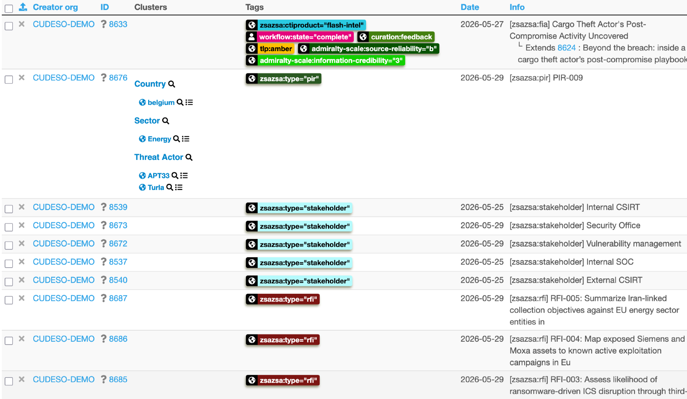

The second view shows how product content and supporting context sit together in one place, so analysts can move from collection evidence to published output without losing traceability.

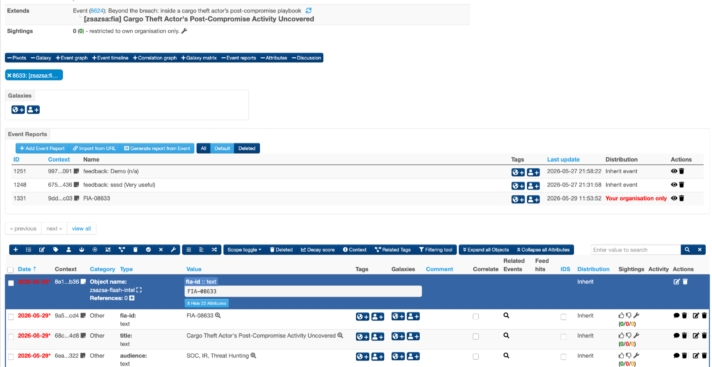


## Dashboard

The dashboard gives a quick operational picture, including pipeline state, active requirements, stakeholder footprint and recent processing results.

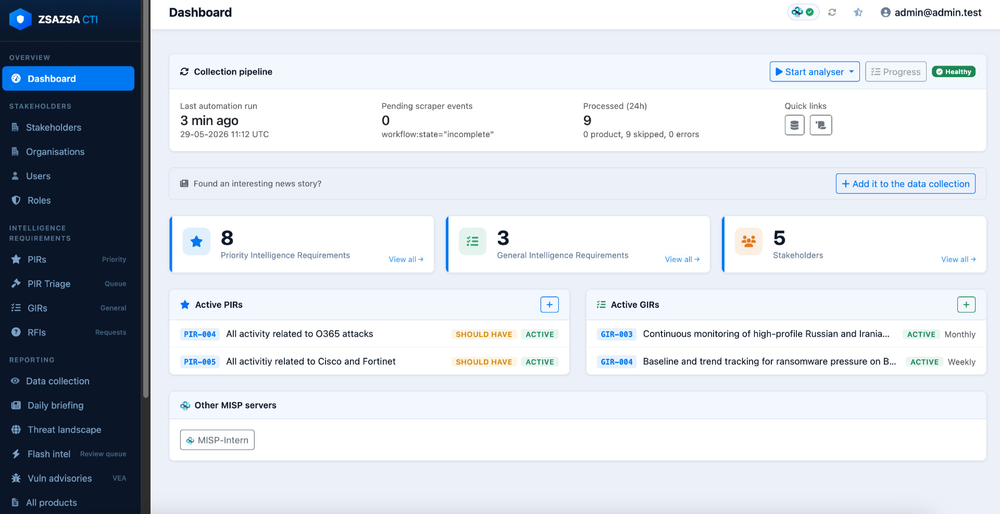

The built-in reference panel helps teams apply common intelligence concepts consistently, including Admiralty Scale, TLP and CTI evaluation criteria.

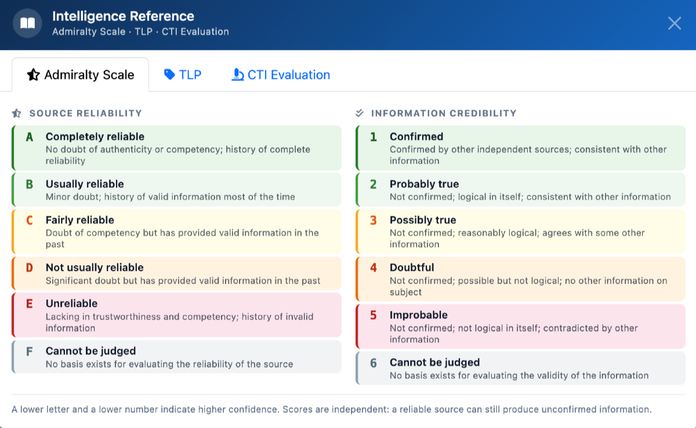

## Stakeholders

Stakeholders are managed locally and linked to MISP organisations. Each record supports internal or external roles, multiple contact fields, TLP clearance, product subscriptions and delivery preferences, so distribution can match real organisational needs.

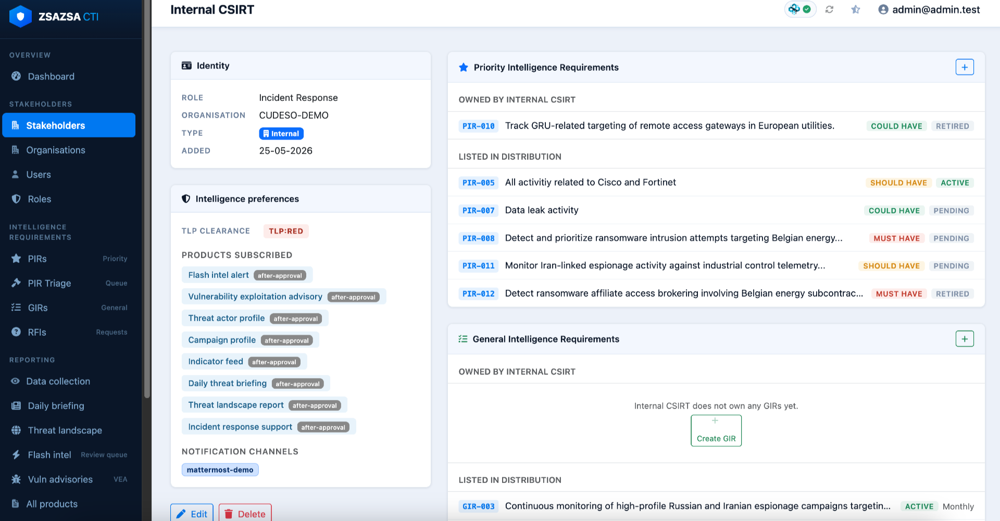

Stakeholders can be linked to PIRs and GIRs for ownership and distribution, which makes accountability and downstream delivery easier to track.

## PIR

PIR pages capture the core intelligence questions that drive collection and analysis priorities.

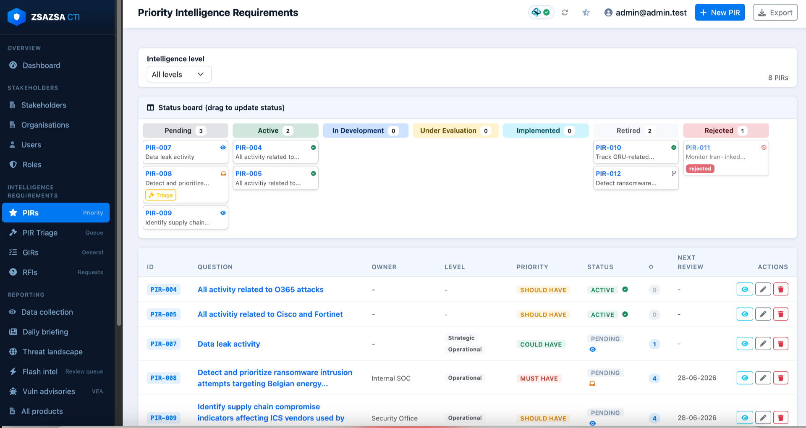

Triage allows submitted PIRs to be acknowledged, approved, deferred, rejected or merged with clear decision context.

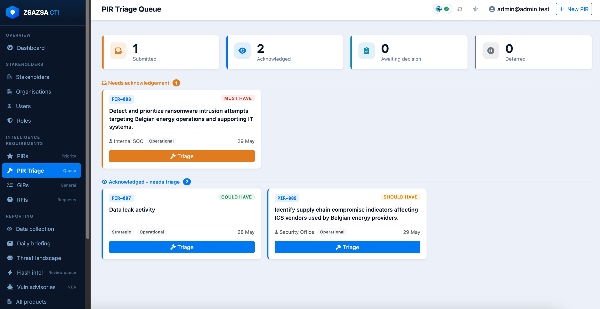

The PIR detail view combines scope, sub-questions, ownership, distribution and collection mapping so analysts can maintain one coherent requirement record.

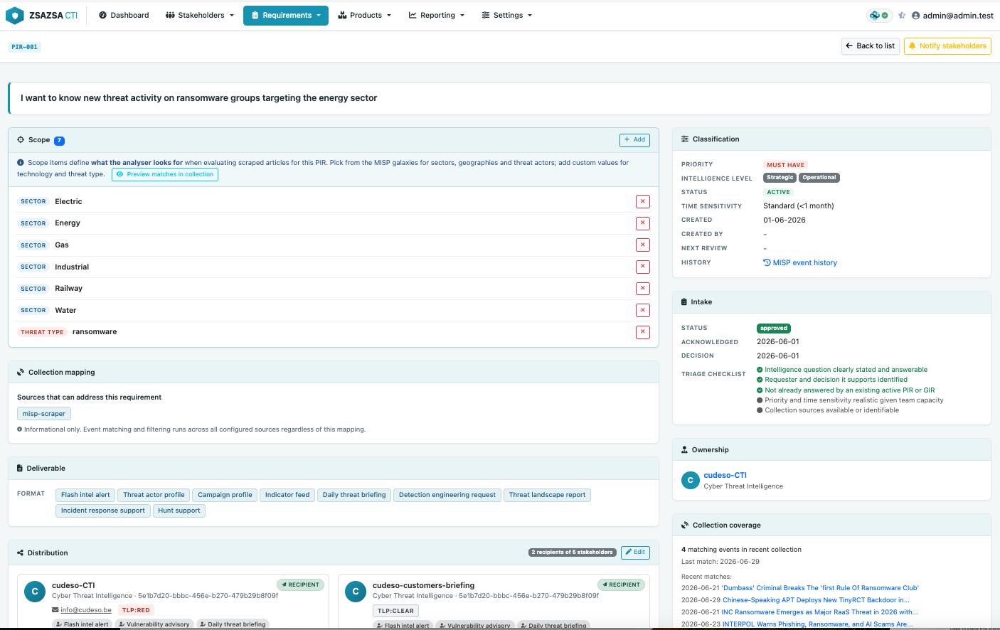

## GIR

GIR records intelligence needs over longer cycles, including review cadence, scope and expected outputs for recurring reporting.

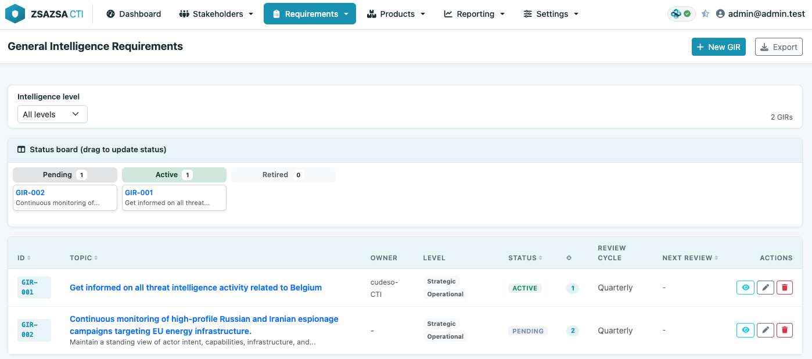

## RFI

The RFI workflow covers intake through closure, with priority, SLA, owner assignment, requirement linkage and response tracking.

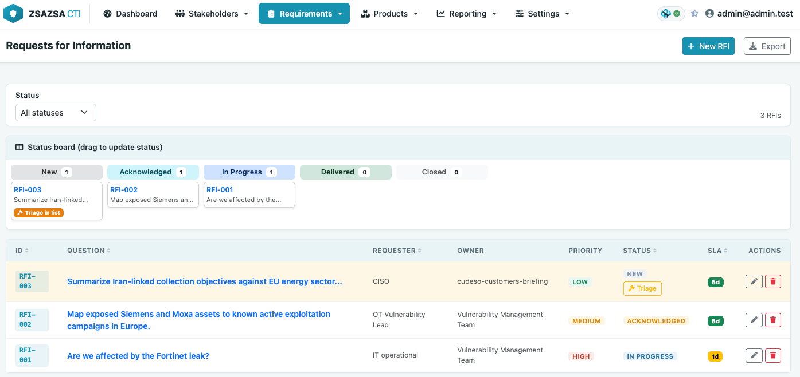

## Data collection

The data collection view provides a cached feed with filters for source, tags and context, helping analysts sift large event volumes quickly.

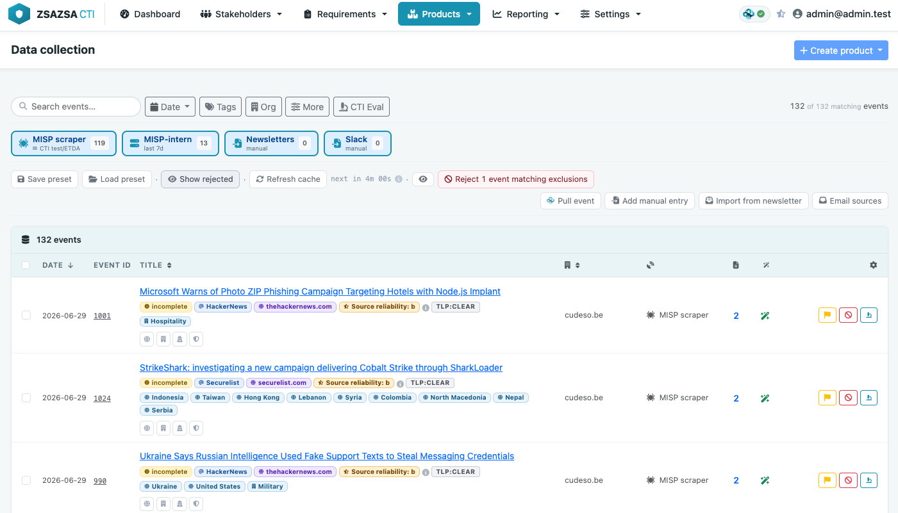

CTI evaluation can be applied during collection triage to score relevance and confidence before product drafting.

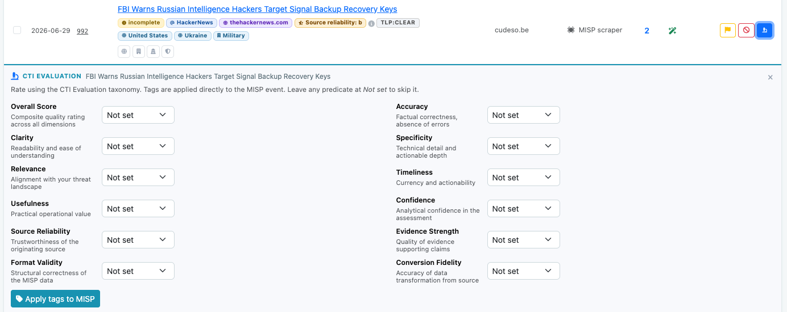

From the same view, analysts can launch product creation directly from selected source events.

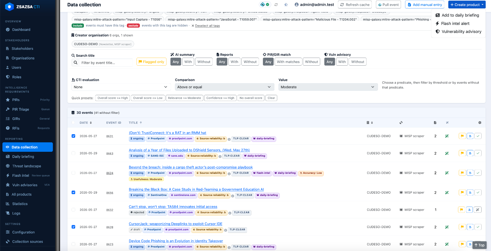

Daily threat briefing drafting is integrated into the collection workflow, so triaged items can be turned into a briefing without context switching.

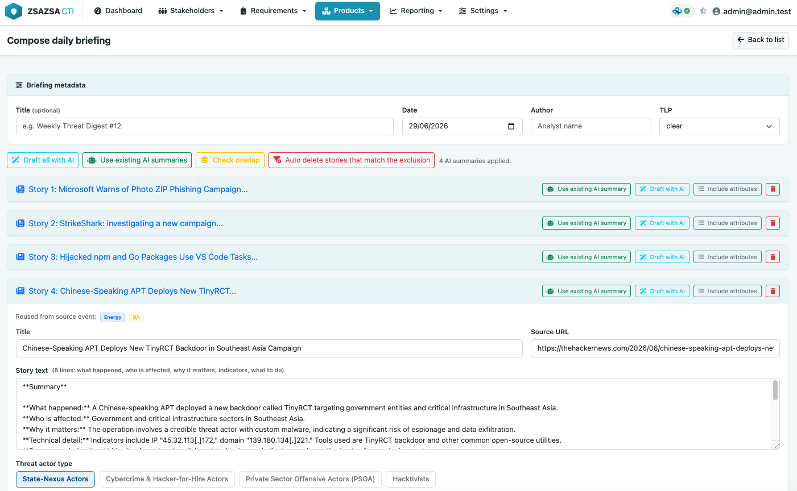

Vulnerability advisory creation follows the same pattern, with evidence and indicators carried forward from source events.

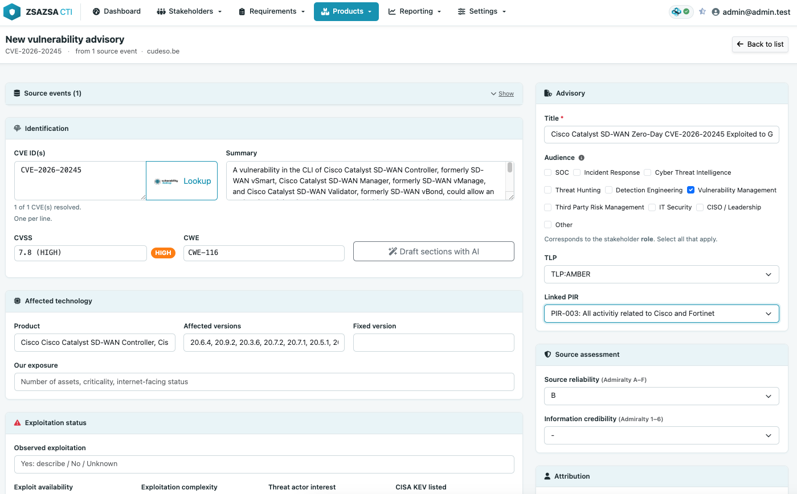

## Statistics

The statistics pages combine operational metrics with CTI maturity signals.

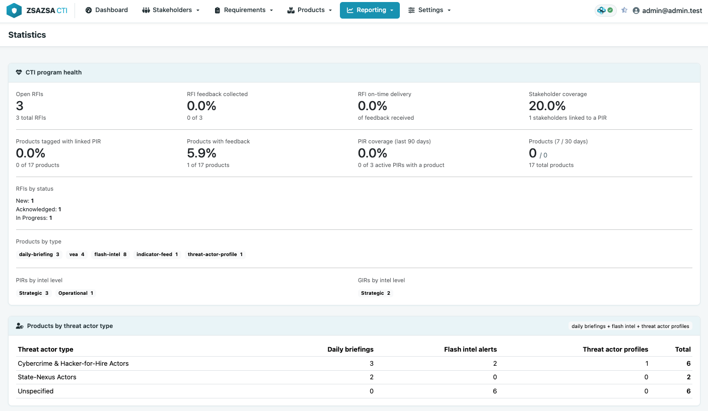

## AI Support

AI-assisted features support analyst efficiency in triage, relevance checking and drafting.

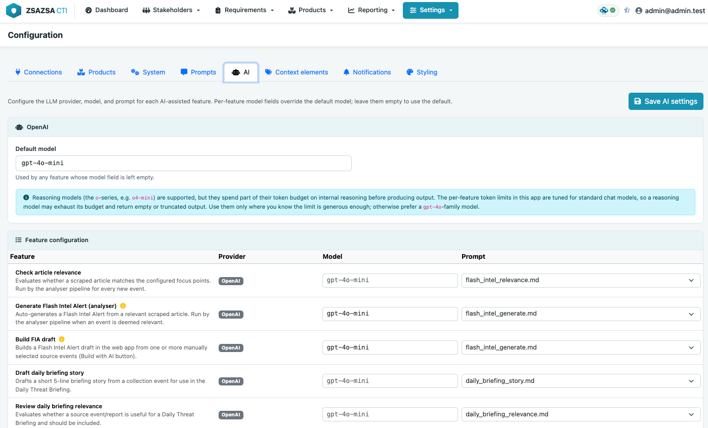

## Data collection source management

Source management allows teams to manage collection sources centrally, including manual sources and additional MISP instances.

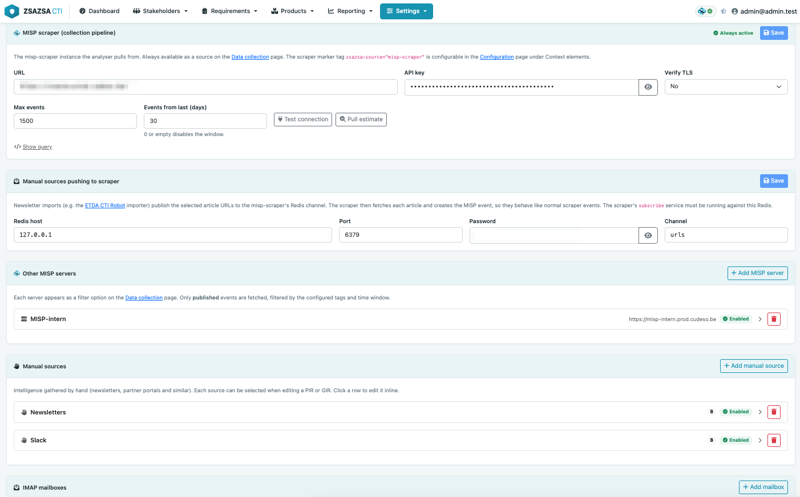


# Why the name zsazsa

Officially, it is the cat.


Unofficially, if anyone asks in a meeting, you can pick one of these:

- Zonal Security Analysis for Zero-day Situation Awareness
- Zero-day Signal Analysis and Strategic Assessment
- Zenith Sentinel for Adversary Surveillance and Alerting
- Zettabyte Source Aggregation for Security Analytics
- Zero-latency Surveillance and Alerting for Security Analysts
- Zealous Search and Attribution for Strategic Analysis
- Zone-focused Scouting and Assessment for Security Assurance
- Zero-trust Scoring and Adversary Signal Assessment
