# zsazsa CTI

zsazsa is a **CTI program** management and production platform built around [MISP](https://www.misp-project.org/). It links collection, triage, analyst workflows, requirement management, publishing and stakeholder delivery in one place.

It is designed for teams that want to run threat intelligence as an operational capability, not as loose documents and disconnected scripts. In one workflow, analysts can move from source events to validated intelligence products, align output to PIR and GIR priorities, distribute to stakeholders, and feed response back into program maturity signals.

If you are setting zsazsa up, start with [INSTALL.md](INSTALL.md). It covers what you need for installation, configuration and deployment.

## Overview


## Intelligence flow

zsazsa follows the daily CTI workflow, from collection through triage and analysis to publishing and feedback. The main areas are:

- **Dashboard** gives a live snapshot of the program: active PIRs and GIRs, stakeholder counts, analyser freshness, the last 24 hours of processing, and scraper events still waiting for triage.
- **Stakeholders** record who receives your output, with role, organisation, TLP clearance, product subscriptions and notification channels, plus a power and interest matrix to plan engagement.
- **Requirements (PIR and GIR)** hold the intelligence questions that drive collection, with their scope, ownership and distribution. Adding scope to a requirement makes matching events light up in the data collection view.
- **RFIs** handle one-off requests from intake to closure, with an SLA, an owner, a linked PIR or GIR, response confidence, attachments, notes and feedback.
- **Data collection** is the cached view of everything arriving from the scraper MISP, other MISP servers, and manual or newsletter sources. You browse and triage events, enrich them with scope from the MISP galaxies, generate an AI summary, and start a product straight from a source event.
- **Products** are a searchable catalogue of what you publish, with inline preview and feedback. zsazsa produces Flash Intel Alerts, Vulnerability advisories, Daily threat briefings, Threat landscape reports, Indicator feeds and Threat actor profiles, each described below.
- **Statistics** cover pipeline and program metrics, RFI and feedback figures, and a scope coverage view showing where collection and analysis are concentrated. A CTI-CMM maturity panel maps the program against levels CTI0 to CTI3, so you can see the next gap to close.


The rest of this section walks through each area with screenshots.

### Records in MISP

zsazsa keeps its operational data in MISP, using events, object templates, attributes and event reports. This keeps auditability clear and lets teams inspect raw records directly in MISP when needed. The MISP **event history** doubles as an audit trail of every change to a product, stakeholder or requirement.


The second view shows how product content and supporting context sit together in one place, so analysts can move from collection evidence to published output without losing traceability.


### Dashboard

The dashboard gives a quick **operational overview**, including pipeline state, active requirements, stakeholder footprint and recent processing results.


The built-in reference panel helps teams apply common intelligence concepts consistently, including the Admiralty Scale, TLP and CTI evaluation criteria.


### Stakeholders

Stakeholders are managed locally and linked to MISP organisations. Each record supports internal or external roles, multiple contact fields, TLP clearance, product subscriptions and delivery preferences, so distribution can match real organisational needs.


Stakeholders can be **linked to PIRs and GIRs** for ownership and distribution, which makes accountability and downstream delivery easier to track. You are not tied to zsazsa for presenting this information either. The full stakeholder list can be exported as Markdown, so it is easy to share or reuse outside the tool.

**Stakeholder matrix**

For each stakeholder you record how much they **influence** the direction of your CTI program (their power) and how much they care about its output (their **interest**). From those two values zsazsa works out the quadrant the stakeholder falls into and places them on a power and interest matrix, so you can see at a glance who to engage closely and who to simply keep informed. 


### Requirements

#### PIR

A PIR captures the intelligence question and its context, the intelligence level it sits at and its priority, along with the decision it supports and any sub-questions that break it down.

To make collection easier, zsazsa can **highlight events from your data collection sources that match a PIR**. For that to work you add scope elements to the requirement: geographic scope, sector, threat actor, attack technique, vendor and product, or even a specific incident or campaign. Whenever an incoming event matches that scope it is flagged in the data collection view, so relevant material surfaces against the requirement that asked for it.


**Triage** allows submitted PIRs to be acknowledged, approved, deferred, rejected or merged with clear decision context.


The PIR detail view combines scope, sub-questions, ownership, distribution and collection mapping so analysts can maintain one coherent requirement record.


#### GIR

A GIR records intelligence needs over longer cycles, including review cadence, scope and the expected outputs for recurring reporting.


As with a PIR, you can add scope items and threat context to a GIR so that matching events are highlighted automatically in the data collection view.

#### RFI

The RFI workflow covers intake through closure, with priority, SLA, owner assignment, requirement linkage and response tracking.


The RFI detail view lets you add notes and file attachments, and, as with the other requirements, capture feedback from the people who raised the request.

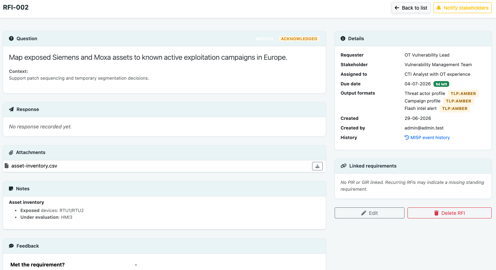

### Data collection

The data collection view provides a cached feed with filters for source, tags and context, helping analysts sift large event volumes quickly.

This is the **central location for the daily work**, where you navigate everything coming in from the sources you have set up: the MISP scraper, any other MISP instances you are connected to, and the manual and newsletter sources you maintain by hand.


**CTI evaluation** can be applied during collection triage to score relevance and confidence before product drafting.


An analyst can **enrich an event** on the spot with scope: geographic reach, targeted sector, threat actor and the techniques used, all drawn from the [MISP galaxies](https://misp-galaxy.org/).

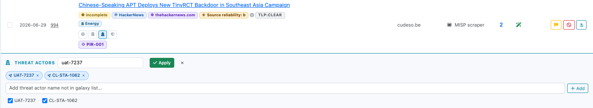

If nothing relevant came in through the configured sources, an analyst can also add an article by hand,

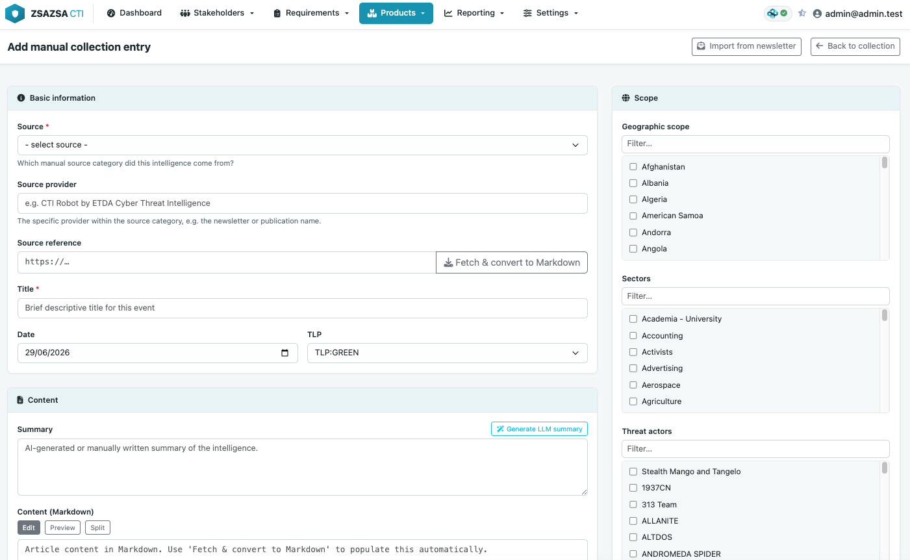

or parse one straight from a security newsletter, such as the one from CTI Robot of ETDA.

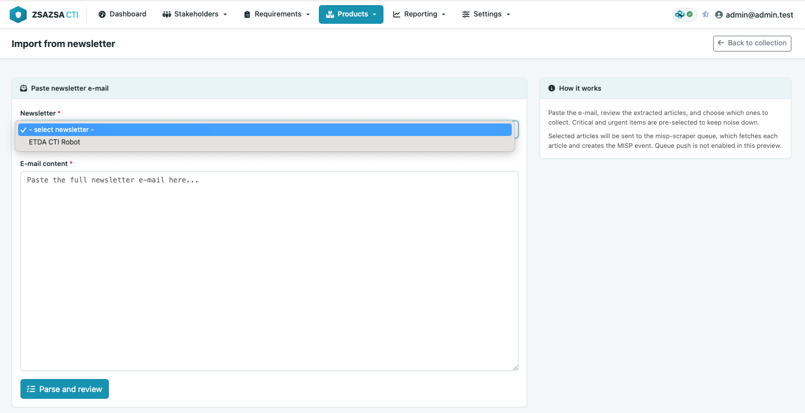

The newsletter import can also read editions that arrive in **a mailbox over IMAP** and pull the useful articles out of each one automatically.

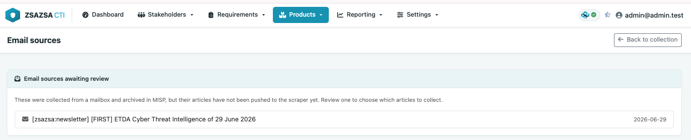

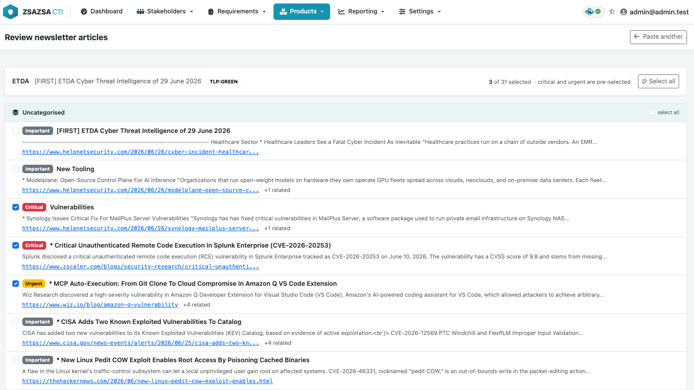

### Intelligence products
From the same view, analysts can **launch product creation** directly from selected source events.


#### Daily threat briefing

**Daily threat briefing** drafting is integrated into the collection workflow, so triaged items can be turned into a briefing without context switching.


#### Vulnerability advisory

**Vulnerability advisory** creation follows the same pattern, with evidence and indicators carried forward from source events.


#### Flash intel alert

In the same way, you can raise a **Flash intel alert** from a threat event.

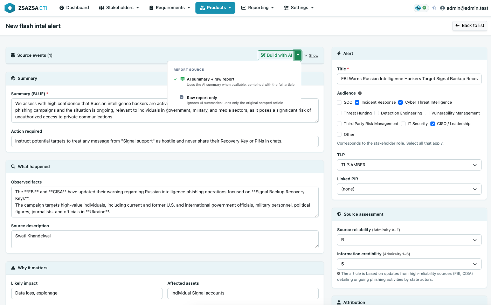

#### Threat actor profile

zsazsa also lets you build a **threat actor profile**. You usually start from what the MISP galaxies already hold about the actor, pull that in as a first draft, and then expand it with your own knowledge and investigation.

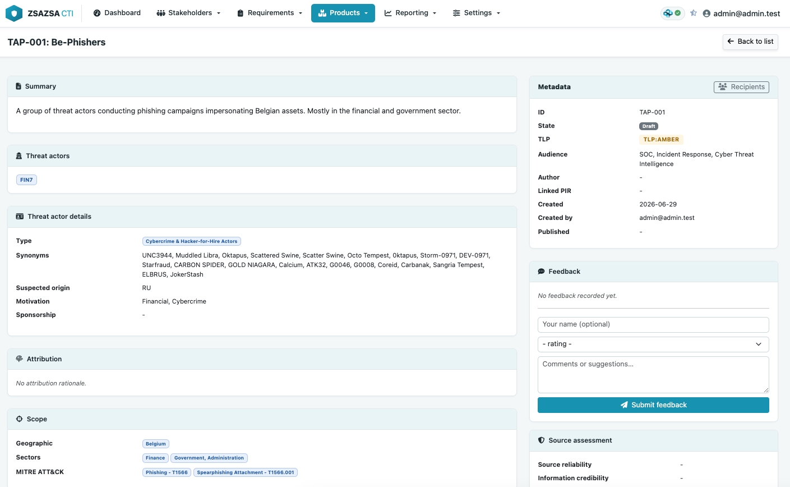

Combining your own findings with the galaxy data, each profile builds a **Diamond Model** view of the actor across adversary, infrastructure, capability and victim. That Diamond Model is also included when you share it over the notification channels, by email, Mattermost and the rest.

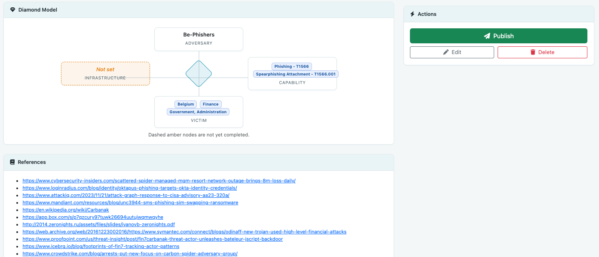

When tracking an actor you often want to list the infrastructure you have observed. You do that with a separate product, the indicator feed, and a threat actor profile can be linked to one or more of them.

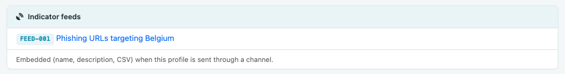

### Indicator feed

The indicator feed is another product. You build a detailed query against MISP and get back the matching list of indicators.

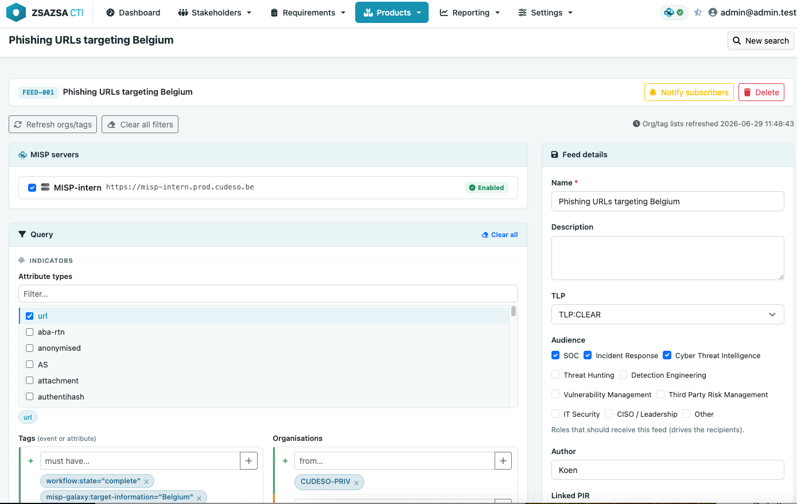

A useful detail is that the feed is kept as a PyMISP query. zsazsa shows you that query and lets you copy it, so you can reuse the same search elsewhere.

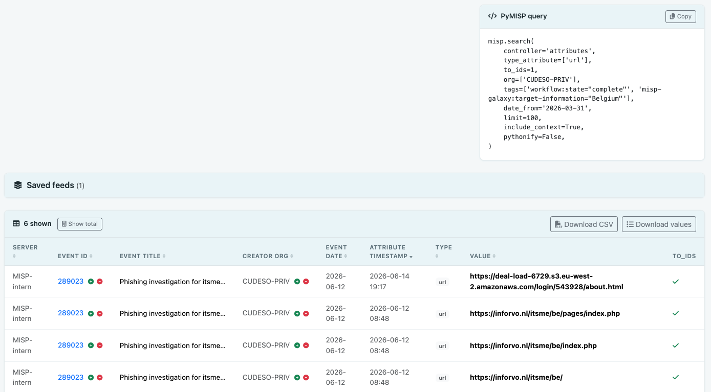

More often you will not need to copy anything, because zsazsa gives **each feed its own unique URL**. Point a tool at that URL and it pulls the indicators directly, without a login.

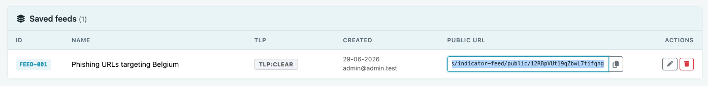

A typical use case: your SOC needs a set of indicators to investigate. Instead of copying them by hand or asking the SOC to dig the data out of MISP, you build an indicator feed, perhaps tied to a threat actor profile, send it as a product through the notification channels, and the recipients receive it as a plain value list or as CSV.

### Statistics

The statistics pages combine operational metrics with CTI maturity info.


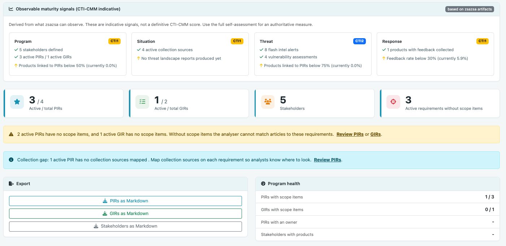

### AI support

AI-assisted features support analyst efficiency in triage, relevance checking and drafting.


### Collection source management

Source management lets teams manage **data collection sources** centrally, including manual sources and additional MISP instances.


## Notification and distribution flow

Distribution is built around stakeholders, roles, product subscriptions, audiences and notification channels. The intended flow is as follows.

A stakeholder is created and takes on exactly one role (SOC, Incident Response, Cyber Threat Intelligence, and so on). Each stakeholder indicates which notification channels they want to receive products on, chosen from the channels configured under Settings (Mattermost webhooks, email recipients and Flowintel instances). A stakeholder also subscribes to one or more product types. The subscription is what the stakeholder wants to receive; the draft or after-approval subscription mode is recorded but currently makes no difference to delivery.

A product is created with one or more audiences. An audience is a stakeholder role, so selecting an audience selects the set of stakeholders holding that role. When a product is published, every selected audience is resolved to its matching stakeholders, and a stakeholder receives the product only if all of the following hold: the stakeholder's role is in the product's audience, the stakeholder is subscribed to that product type, and the stakeholder's TLP clearance is high enough for the product's TLP. Eligible stakeholders then receive the product over the notification channels they configured. A channel can accept every product, or it can be restricted to specific product types. [Flowintel](https://flowintel.org/) is an example of a restricted channel: a case is created only on the Flowintel instances those recipients subscribed to, and only for products that are enabled for that instance in its `case_templates` configuration.

Eligibility is computed centrally by `recipient_preview()` in `webapp/misp_store.py`, which classifies every stakeholder as green (will receive the product), yellow (subscribed but blocked by TLP or audience) or grey (not subscribed). The product detail and review pages show this preview before publishing, so you can see exactly who will and will not receive a product before you send it.

Coverage differs per product type:

- **Flash Intel Alert** and **Vulnerability advisory** implement the full flow above, including audience, subscription, TLP gating, and delivery to Mattermost, email and Flowintel.
- **Threat actor profile** implements the same audience, subscription and TLP-gated flow over Mattermost and email once published, and additionally embeds its Diamond Model image and any linked indicator feed content in the message.
- **Indicator feed** is pushed to the stakeholders subscribed to it (audience and TLP gated), with the indicator values in the message and the full feed attached as CSV by email.
- **Daily threat briefing** is delivered to all stakeholders subscribed to it, over each recipient's configured notification channels. It has no audience and applies no TLP gating.
- **Threat landscape report** records an audience but does not yet push notifications on publish.
- **PIR**, **GIR** and **RFI** are requirements rather than products. They notify an explicitly selected distribution list of stakeholders over Mattermost and email, independent of product subscriptions and audiences.
- The remaining product types listed under `PRODUCT_TYPES` can be subscribed to but do not yet have a publish-and-notify flow.

Email channels deliver the full product as an email, the same Markdown that drives the other channels, rendered to HTML with a plain-text fallback. When a single product reaches several email recipients, their addresses are kept private from one another. Email delivery relies on the shared SMTP server configured on the Notifications tab; the per-channel value is just the recipient address.

## What the analyser does

The dashboard has a **Start analyser** button with three options: **Daily threat briefing**, **Flash intel alert** and **Vulnerability advisory**. All three start from the same pool of events, but each one decides differently what to do with them. None of them publish anything or notify stakeholders. They only create **drafts** that you then review, edit and publish yourself.

### The events all three start from

Whichever option you choose, the analyser first builds the same candidate list:

1. It refreshes the data collection cache.
2. It asks the scraper MISP (the server set as `MISP_URL`) for events created **today** (UTC) that carry the scraper marker tag (`SCRAPER_MARKER_TAG`), up to `MISP_SCRAPER_LIMIT` events.
3. It keeps only the events that still need work, meaning their workflow state is `incomplete` or `ongoing`. Events already marked `complete` or `rejected` are left alone.
4. It drops events it cannot use: the article could not be fetched (HTTP error) or the report is empty. These are marked `rejected`.
5. For each remaining event it makes sure an AI summary report exists, and creates one if it is missing.

So every run works on "today's freshly scraped events that have not been processed yet". An event that has already been turned into a given product is skipped for that same product, so running an option twice does not create duplicates.

### Daily threat briefing

This option is about **situational awareness**, not requirements.

- It applies the title exclusion list (`DAILY_BRIEFING_TITLE_EXCLUSIONS`) and skips events already used in an earlier briefing.
- For each candidate it asks the AI whether the story is relevant to your organisation, judged against the focus points (geographies, sectors, technologies, threat types and threat actors) set in Settings. Stories that are not relevant are rejected, with the reason written back onto the event.
- For the stories it keeps, it drafts a short write-up, pulls out sectors, geographies, techniques, threat actors and vendors from the summary, and drops near-duplicate stories.
- The result is one **daily briefing draft** holding the day's stories, ready to review and publish.

There is no PIR or GIR step here. What is relevant is decided by your focus points and the AI, not by your requirements.

### Flash intel alert

This option is **requirement-driven**. It only acts on events that match something you are actively tracking.

- For each candidate event it compares the event's tags and galaxy clusters against the scope of your **active PIRs and GIRs**.
- An event that matches at least one PIR or GIR gets a **flash intel draft**, pre-filled with the summary and linked to the best-matching PIR.
- An event that matches nothing is skipped and logged as **"no PIR/GIR match"**. This is the line you see in the pipeline run. It is not an error. It means the event was not relevant to any current requirement, so no draft was made.
- If you have no active PIRs or GIRs, or none whose scope fits today's events, this option creates nothing. That is expected.

In other words, the "no PIR/GIR match" entries are the analyser showing you which events it looked at but deliberately left alone, because they do not line up with your stated priorities.

### Vulnerability advisory

This option is **CVE-driven**.

- For each candidate event it looks for a CVE identifier, in the event attributes or the report text.
- An event with at least one CVE gets a **vulnerability advisory draft**. The CVE is enriched from a vulnerability database (CVSS score, affected products and versions, description) and the advisory sections are drafted by the AI.
- An event with no CVE is skipped and logged as **"no CVE found"**.

Like the daily briefing, this option does not use PIR or GIR matching. Its only filter is whether the event mentions a CVE.

### The three options side by side

| Option | What it acts on | What it skips, and why | Output |
|---|---|---|---|
| Daily threat briefing | Today's scraped events the AI judges relevant to your focus points | Off-topic stories, excluded titles, events already briefed | One daily briefing draft with the day's stories |
| Flash intel alert | Today's scraped events that match an active PIR or GIR | Events logged as "no PIR/GIR match" | One flash intel draft per matched event |
| Vulnerability advisory | Today's scraped events that mention a CVE | Events logged as "no CVE found" | One vulnerability advisory draft per CVE event |

In every case the analyser stops at drafts. Publishing and sending to stakeholders is always a separate step you take by hand.

## MISP model and tagging approach

The platform stores each business entity as one MISP event, with its data held inside a custom MISP object. The custom object templates live in `webapp/misp_objects/`.

Each entity type maps to one MISP object:

| Entity | MISP object |
|---|---|
| Stakeholder | zsazsa-stakeholder |
| PIR | zsazsa-pir |
| GIR | zsazsa-gir |
| RFI | zsazsa-rfi |
| Flash Intel Alert | zsazsa-flash-intel |
| Vulnerability advisory | zsazsa-vea |
| Daily briefing | zsazsa-daily-briefing |
| Threat landscape report | zsazsa-threat-landscape-report |
| Indicator feed | zsazsa-indicator-feed |
| Threat actor profile | zsazsa-threat-actor-profile |
| Collection source | zsazsa-collection-source |

Every entity event also carries a type tag, so it can be searched and filtered independently of the object it holds. All tags in the `zsazsa:` namespace are applied as local tags, so they never sync to connected MISP instances. Because MISP attaches tags that are embedded at event creation globally even when the local flag is set, the application applies these tags through the tag endpoint right after the event is created. The default tag values are:

```
TAG_STAKEHOLDER  = zsazsa:type="stakeholder"
TAG_PIR          = zsazsa:type="pir"
TAG_GIR          = zsazsa:type="gir"
TAG_RFI          = zsazsa:type="rfi"
TAG_FLASH_INTEL  = zsazsa:ctiproduct="flash-intel"
TAG_VEA          = zsazsa:ctiproduct="vea"
TAG_BRIEFING     = zsazsa:ctiproduct="daily-briefing"
TAG_INDICATOR_FEED        = zsazsa:ctiproduct="indicator-feed"
TAG_THREAT_ACTOR_PROFILE  = zsazsa:ctiproduct="threat-actor-profile"
```

Product events additionally carry `curation:ctiproduct` tags, so they can be searched and grouped consistently across the product catalogue.

Every product and requirement detail page links to the MISP event's history (its audit log), so you can inspect the full change history of a stored object directly in MISP. Editing updates the object's attributes in place rather than replacing it, so that history is kept across changes.

Manual collection entries are stored on the webapp MISP server. They carry the scraper marker tag (`zsazsa:source="misp-scraper"` by default), a TLP tag, `zsazsa:source-type="manual"`, and a local `zsazsa:source="<source-name>"` tag linking the entry to the configured manual source. Galaxy-backed scope tags (geography, sector, threat actor, MITRE ATT&CK) are applied as regular MISP tags. The entry description is stored as a MISP event report in Markdown, and file attachments are added as attachment attributes in the External analysis category.

Events that need analyst follow-up are flagged with `zsazsa:collection="follow-up"` as a local tag.

Focus points are stored as event-level text attributes with the comment `zsazsa:fp` and the value format `category|value|notes`. This keeps add and delete operations simple and lets scope values be regenerated safely without losing other attribute data.

## Importing newsletters

Many teams receive curated security newsletters by e-mail, for example the ETDA Cyber Threat Intelligence (CTI Robot) digest, where one edition can list dozens of articles. Rather than copy them in one by one, the newsletter importer turns a pasted e-mail into a reviewable list. Open it from the Data collection page with "Import from newsletter", choose the format, paste the e-mail and select "Parse and review". The importer pulls out each article with its section, its criticality and its links, and pre-selects the critical and urgent items so you only confirm what is worth collecting.

Sending does two things. Each selected link is handed to the misp-scraper, which fetches the article and creates a MISP event for it, so it flows through the normal collection pipeline. The newsletter itself is archived as its own MISP event, with the raw e-mail kept as a report and the links attached. Make sure the misp-scraper subscriber is running first (see "Manual sources pushing to scraper" in [INSTALL.md](INSTALL.md)); if nothing is listening when you send, the importer tells you, so nothing is lost silently.

### Technical notes

Each newsletter format has its own parser registered in `webapp/newsletter_parsers.py` (the `PARSERS` map), so supporting a new format means writing one parser and registering it; the import screens themselves are format-agnostic. Parsing is pure text processing and never touches MISP.

The hand-off to the scraper uses Redis publish/subscribe: zsazsa publishes one JSON message per selected article on the configured channel, and the scraper's `subscribe` service consumes it. The connection (`SCRAPER_REDIS_HOST`, `SCRAPER_REDIS_PORT`, `SCRAPER_REDIS_PASSWORD`, `SCRAPER_REDIS_CHANNEL`) is set on the "Manual sources pushing to scraper" card, and is separate from the Redis that zsazsa reads MISP login sessions from.

Each message carries the article link, the title, the newsletter name as the feed title, and `feed_tags` that the scraper applies as local tags on the created event.

### Collecting newsletters from a mailbox (IMAP)

Instead of pasting each edition by hand, zsazsa can read newsletters straight from a mailbox. Forward the newsletter (for example the ETDA digest) to a mailbox, and zsazsa polls that mailbox, processes new editions the same way the manual importer does, and marks the e-mail as handled so it is never processed twice.

Mailboxes are configured on the Collection sources page (`/config/sources/`) under "IMAP mailboxes". A mailbox holds only the connection (host, port, SSL, credentials and the folder to read). Under it you add one or more **data collection sources**, one per newsletter, each with a name, the parser to apply, match criteria (subjects and senders, one per line), an Admiralty reliability rating and a mode. A message goes to the first source whose subject or sender matches; leaving both lists empty makes a source take every message, which suits a mailbox dedicated to one newsletter. The sender match also reads the original `From:` line inside a forwarded message, so forwarding does not hide the real sender. Passwords are stored in `config.py` under `IMAP_SOURCES`, never in a MISP event.

The source name is what events are attributed to: it becomes the feed handed to the scraper, so the created events carry `scraper:data-collection-source:<name>` and the Pipeline page counts them per source. Splitting one mailbox into several named sources is therefore also how you track how much each newsletter contributes.

Each source runs in one of two modes. In **automatic** mode a matched newsletter is archived and its links are pushed to the scraper straight away. In **manual review** mode it is archived and parked in a pending queue, so a human picks the articles first, from the Data collection page under "Email sources". If an automatic push finds no scraper listening, the edition moves to the pending queue rather than being lost, so you can retry it.

Polling is done by `run_imap_collector.py`, intended to run from cron, for example every fifteen minutes:

```
*/15 * * * * cd /path/to/zsazsa && venv/bin/python run_imap_collector.py
```

The Pipeline page (`/pipeline`) shows each mailbox with its last poll and result, and every poll also appears in the run history. Processed messages are flagged with a dedicated IMAP keyword (`zsazsaProcessed`) and marked Seen and Flagged; the keyword, not the read state, is what prevents reprocessing, and nothing is ever deleted from the mailbox.

## Blog posts and further reading

These write-ups go deeper on specific workflows:

[Create a daily threat briefing with zsazsa and MISP](https://www.misp-project.org/2026/06/08/zsazsa-create-a-daily-threat-briefing.html/) on the MISP project website walks through the full workflow for producing a daily threat briefing, from source event triage to publishing.

## Why the name zsazsa

Officially, it is the cat.


Unofficially, if anyone asks in a meeting, you can pick one of these:

- Zonal Security Analysis for Zero-day Situation Awareness
- Zero-day Signal Analysis and Strategic Assessment
- Zenith Sentinel for Adversary Surveillance and Alerting
- Zettabyte Source Aggregation for Security Analytics
- Zero-latency Surveillance and Alerting for Security Analysts
- Zealous Search and Attribution for Strategic Analysis
- Zone-focused Scouting and Assessment for Security Assurance
- Zero-trust Scoring and Adversary Signal Assessment
